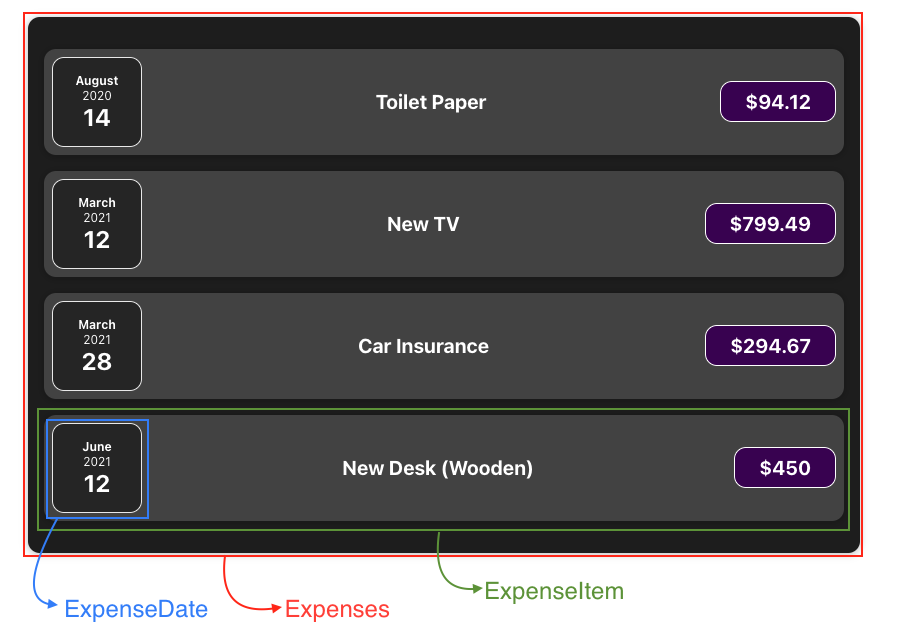

# [Udemy] Prefect REACT Guide (with Redux, Next.js, TypeScript)

---

## Section 3. 리액트 기초 및 실습 컴포넌트

3-1 Module

3-2 Component

3-3 React Project (feat. CRA)

3-4 Composition (props.children)

3-5 JSX (feat.createElement)

3-6 Constructing Component File

3-7 State

---


## <span style='font-weight:700;background:#D3D3D3'>Module</span>
Component-Driven User Interfaces
Building Interactive & Scalable UIs 
Component 라는 개념 이용하여 UI 만들기

Module Content
- React Core Syntax & JSX
- Working with Components 
- Workign with Data 
  - props

<br>
## <span style='font-weight:700;background:#D3D3D3'>Component</span>

<span style='font-weight:700;background:#D3D3D3'>컴포넌트란 무엇인가? 왜 리액트는 컴포넌트의 전부라고하는가?</span>

리액트는 컴포넌트로 구성되어있다

React is a JavaScript library for building user interfaces
HTML, CSS & JavaScript are about buildign user interfaces as well
React makes building complex, interactive and reactive user interfaces __simpler__

React is all about "__Components__"
Because all user interfaces in the end are made up of components

#### Why Components?
- Reusability  재사용성
    DRY(Don't Repeat Yourself)
- Separation of Concerns  관심사의 분리
    Don't do too many things in one and the same place (function)
- Reusability, Separation of Concerns => Split big chunks of code into multiple smaller functions 


<span style='font-weight:800;background:#fff5b1'>리액트 코드는 '선언적 방식'으로 작성됐다</span>

#### How is a Component built?
- React allows you to create __re-usuable and reactive components__ 
    consisting of __HTML and JavaScript__ (and CSS)    
=> Declarative Approach ('선언 접근 방식' 으로 컴포넌트 생성)
=> Define the desired target state(s) and let React figure out the actual JavaScript DOM instructions __'최종 상태' 만 정의하면 된다__

Build your own, __custom HTML Elements__

- <span style='font-weight:800;background:#fff5b1'>Custom Component (사용자 지정 컴포넌트) 들은 실제로 화면에 보이게 되는 HTML 요소가 아니고, 
단순히 사용자가 React 코드, JSX 코드에서 사용하게 된다. 
결국 화면에 나타나는 건 HTML 요소들인데, 
그 이유는 우리가 만드는 모든 Custom Components 는 이러한 내장된 HTML 요소들을 사용하거나 다른 컴포넌트들(결국 이들도 내장된 HTML 요소들을 사용한 것임)을 사용하기 때문이다. </span>

<br>
## <span style='font-weight:700;background:#D3D3D3'>React Project 생성 및 분석(feat. CRA)</span>
1. CRA  
yarn create react-app react-complete-guide 

2. npm 설치 
npm install 
(완료 후, node_modules 폴더 생성 확인. =로컬 시스템에 다운된 third-part-packages)

3. 프로젝트 실행
yarn start 

#### <span style='font-weight:800;background:#F05650'><!></span> <U>index.js 파일은 첫 번째로 실행되는 파일</U>
#### 1) src/index.js
- 'react-dom'(third-party library, 목록은 package.json 에서 확인) 에서 ReactDOM 객체를 import 
- package.json 에는 두 개의 리액트 종속성(dependency)가 있음 : __react__, __react-dom__
    이들은 다른 책임을 맡는 두 개의 분리된 package 이지만, 결국 함께 React Library 가 된다
- react 는 리액트 자체를, react-dom 은 리액트의 특성을 이용할 수 있다
- (참고 : third-party library 또는 JS 파일은 import 시, 확장자 생략)
```
import React from 'react';
import ReactDOM from 'react-dom';
import App from './App';

ReactDOM.render(
  <React.StrictMode>
    <App />
  </React.StrictMode>,
  document.getElementById('root')
);
```
#### 2) public/index.html
- 처음 실행 시, 브라우저에서 로드된 single HTML file
- 리액트는 SPA (Single Page App) 를 만들기 때문에 하나의 HTML 파일(index.html)만이 브라우저에 전달되고, 브라우저에 의해 host (or render) 된다
- 하나의 싱글 파일에서는 완성된 React App code 를 가져오지만 이것이 시작 코드는 아니다. 스크린에서 뭘 보게 될지 업데이트되는 일을 한다
- index.js 에서 id=root 인 div 를 <App /> 컴포넌트로 대체
```
 <body>
    <div id="root"></div>
</body>
```
#### 3) src/App.js
##### JSX
- 유효한 JS 코드가 아님에도 작동 : __JSX__ 라는 특성 (리액트의 특별 구문). '변형 과정' 이 있었기 HTML 코드가 JavaScript 코드로 변형됨. 브라우저에서 작동하는 코드로 변형됨
- JSX 코드 : JavaScript 내에 있는 HTML 코드
- JSX stands for '__JavaScript XML__' (HTML 은 결국 XMl 이므로) 
- 자동으로 변환되므로 코드를 쓰기 쉽다! (developer-friendly code)
##### Component
- Component : 전용 HTML 요소 (__custom HTML elements__)
- __Declarative Approach__ (선언적 접근방식) : 선호하는 타겟 상태(or 최종 상태)를 정한 뒤, 실제 돔 지시를 생성 및 실행 
    예) App 의 JSX 코드가 우리가 원하는 타겟 상태. 즉, 화면에 Hello React 를 띄우는 것이 최종 목표.
- 반대되는 __imperative Approach__ (명령형 접근법) : 기존 JavaScript 로 작성했던 방식. JavaScript 와 Browser 가 수행할 일들에 대한 확실한 단계별 지시가 있음
    ```
    const para = document.createElement('p')
    para.textContent = 'This is also visible'
    document.getElementById('root').append(para)
    ```

```
function App() {
  return (
    <div>
        <h2>Hello React</h2>
    </div>
  );
}
export default App;
```
<br>
####Build a Component Tree
- 하나의 컴포넌트의 return 명령 당 (혹은 하나의 JSX 코드 당) 하나의 Root 요소만 가져야 한다
```
<App />    : Rendered into single HTML Page (by ReactDOM render instruction)
  |____<Header />
  |
  |
  |____<Tasks />
        |___<Task />
        |___<Task />
        |___<Task />
```

#### <span style='font-weight:800;background:#F05650'><!></span> <U>React 에서 Component 는 JavaScript 함수 일 뿐이다</U>

<br>
## <span style='font-weight:700;background:#D3D3D3'>Composition</span>
__Composition__ : 작은 빌딩 블록을 모아 UI (User Interface) 를 만드는 것

Shell 역할을 하는 Component 
: ExpenseItem 콘텐츠나 Expenses 콘텐츠를 div 대신 특정 CSS 로 꾸며진 카드로 감싼다

ExpenseItem.js 에서 ```return (<div>...</div>)``` 대신 ```return (<Card>...</Card>)```

단, custom component 인 Card 컴포넌트를 다른 콘텐츠에서 wrapper 로 사용할 수는 없다 
그렇다면 ```return (<Card>...</Card>)``` 와 같이 사용하려면 어떻게 해야할까?
=> <span style='font-weight:800;background:#fff5b1'>__재사용 래퍼 컴포넌트 (reusuable wrapper component)__ 를 만든다!</span>
<br>
<span style='font-weight:800;background:#fff5b1'>__props.children__</span>
- children 은 reserved name 
- this special 'children' prop will always be contents, which are between opening tag and closing tag of my custom tag.
- 이를 이용하여 HTML 코드(div 에 있는 복잡한 JSX 코드), CSS 코드를 추출하여 코드 복제를 저장할 수 있다.
  - 다른 컴포넌트를 깨끗하게 유지!
```
function Card(props) {
  return (
    <div className='card'>{props.children}</div>
  )
}

export default Card
```
```
function ExpenseItem(props) {
  return (
      <Card className='expense-item'>
        <ExpenseDate date={props.date} />
        <div className='expense-item__description'><h2>{props.title}</h2></div>
        <div className='expense-item__price'>${props.amount}</div>
      </Card>
  )
}

export default ExpenseItem
```
- HTML 요소는 모두 props.children 을 이용하여 shell component (=Card) 내부로 가지고 왔다. 

- 하지만 __CSS__ 는? 
  - 외부의 모든 default HTML element(예: ```<div>```, ```<h2>``` 등) 는 CSS class 를 추가할 때 className 을 지원. HTML element 를 render 하기 위함
  - 하지만 custom component (custo HTML element) 는 사용자가 지원하라고 지정한 것만 지원한다. 따라서, 직접 className 이 Card component 를 설정하도록 하고 영향을 미치기를 원한다면 아래와 같이 코드를 수정해야 한다
  - CSS 파일 내부에서 분리된 Wrapper Component 로 코드 복제를 추출!
```
function Card(props) {
  const classes = 'card ' + props.className // 외부에서 받은 모두 className 을 문자열에 담기
  return (
    <div className={classes}>{props.children}</div>
  )
}

export default Card
```


이런 식으로 완성된 Reusuable Wrapper Component 는 여기저기에 쉽게 적용 가능하다.
Card 라는 이름에 걸맞게, 콘텐츠를 담는 모서리가 둥근 직사각형 모양의 wrapper 가 필요하다면 어디에든지 적용할 수 있다.
전체 내용을 감싸는 곳에 Card 를 적용해보자.
```
function Expenses(props) {
  return (
    <div className='expenses'>
        <ExpenseItem title={props.items[0].title} amount={props.items[0].amount} date={props.items[0].date} />
        <ExpenseItem title={props.items[1].title} amount={props.items[1].amount} date={props.items[1].date} />
        <ExpenseItem title={props.items[2].title} amount={props.items[2].amount} date={props.items[2].date} />
        <ExpenseItem title={props.items[3].title} amount={props.items[3].amount} date={props.items[3].date} />
    </div>
  )
}

export default Expenses
```
```
function Expenses(props) {
  return ( 
    <Card className='expenses'>
        <ExpenseItem title={props.items[0].title} amount={props.items[0].amount} date={props.items[0].date} />
        <ExpenseItem title={props.items[1].title} amount={props.items[1].amount} date={props.items[1].date} />
        <ExpenseItem title={props.items[2].title} amount={props.items[2].amount} date={props.items[2].date} />
        <ExpenseItem title={props.items[3].title} amount={props.items[3].amount} date={props.items[3].date} />
    </Card>
  )
}

export default Expenses
```
그러면 이렇게 가장 바깥이 둥근 형태로 잘 적용된다.

<br>
## <span style='font-weight:700;background:#D3D3D3'>JSX</span>
- Browser 는 JSX 코드를 지원하지 않는다
- 우리는 가독성 높은 코드를 작성하고, 브라우저에서 보여주기 전에 변환하는 것
  - package.json 의 dependency 들 대부분이 (보이지 않는 곳에서의) 변환을 다룬다
  - 그 중 React 와 연관 있는 두 개의 dependency : react, react-dom
  
  - index.js 에서 react-dom 은 사용하고 있지만, react 는 사용하고 있지 않다. 어디에서도 react 는 import 하지 않고 있다. (다른 버전의 CRA 나 다른 프로그램에서는 react 를 불러올 수도 있음)
  ```
  // index.js
  import ReactDOM from 'react-dom';
  import App from './App';

  ReactDOM.render(<App />, document.getElementById('root'));
  ```
  - 과거에는 사실상 모든 React Component file 에서 React 를 import 해야만 했다 (더 정확히 말하자면, JSX 를 사용하는 모든 file 에서)
  JSX 코드는 읽기 쉽고 이해하기 편한 문법에 불과해서, 과거에는 import해와야 했다. 
  ``` return ( <div>...</div> ) ``` return( ) 내부의 JSX 코드는 import 된 React 객체의 method로 변형된다. (React.createElement)
  
  - 이제 꼭 그렇게하지 않아도 되는 이유는, 최신 React Project Setup 이 React 를 import 하지 않고도 변형이 가능하게끔 하기 때문. 
  사용되고 있지 않은 것이 아니다. 사실상 뒤에서 열심히 JSX 코드를 변형하고 있다!!
  ```
  // common JSX code (before transformed by React)
  return (
    <div>
      <h2>Let's get started!</h2>
      <Expenses items={expenses} />
    </div>
  )
  ```
  ```
  // after transformed by React
  return React.createElement(
    'div',
    {},
    React.createElement('h2', {}, 'Let's get started!'),
    React.createElement(Expenses, { items: expenses })
  )
  ```
- 변형된 코드를 보면, 왜 root JSX element 로서 1개의 wrapper element 가 필요한지 알 수 있다 : createElement 입장에서 여러 개의 엘리먼트들을 return 하면 작성할 수 없기 때문!
  - createElement 는 항상 1개의 element 를 생성한 후에 child element 를 여러 개 더 가질 수 있다.
```
  // IMPOSSIBLE (several root elements)
  return (
    <h2>Let's get started!</h2>
    <Expenses items={expenses} />
  )

  return 
    React.createElement('h2', {}, 'Let's get started!'),
    React.createElement(Expenses, { items: expenses })
  
```
```
  // POSSIBLE (one root element)
  return (
    <div>
      <h2>Let's get started!</h2>
      <Expenses items={expenses} />
    </div>
  )

  return React.createElement(
    'div',
    {},
    React.createElement('h2', {}, 'Let's get started!'),
    React.createElement(Expenses, { items: expenses })
  )
  ```

<br>

## <span style='font-weight:700;background:#D3D3D3'>Constructing Component Files</span>

파일을 잘 정리하고, 컴포넌트들을 체계화시키고, 모든 컴포넌트들이 하나의 큰 폴더에 들어있지 않게끔 한다.

Component 는 아래와 같은 기준으로 나눌 수 있다.
1) 앱의 특정 기능에 국한되지 않은 일반적인 UI Component
2) 특정 기능을 가진 Component 


이와 같은 상황에서는 다음과 같이 나눌 수 있으며, 나눈 기준 별로 폴더를 생성하여 정리해준다.
- 기능을 가진 Component : Expenses, ExpenseItem, ExpenseData (Expenses 의 데이터 렌더링 처리)
- UI Component : Card


<br>

## <span style='font-weight:700;background:#D3D3D3'>State</span>
컴포넌트 파일 구성 : 