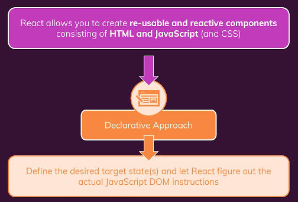
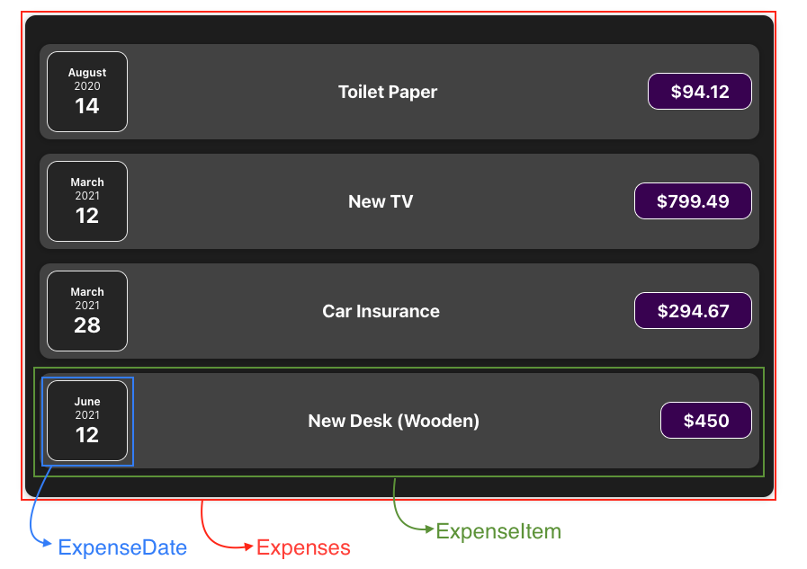

# [Udemy] Prefect REACT Guide (with Redux, Next.js, TypeScript)

---

## Section 4. 리액트 State 및 이벤트 다루기

3-1 What to Learn

3-2 State

3-3 

---


## <span style='font-weight:700;background:#D3D3D3'>What to Learn</span>
####User-Interaction & State : Making Apps Interactive & Reactive

##### < Module Content >
- Handling Events
- Updating the UI & Working with "State"
- A Closer Look at Components & State 
---

<br>
## <span style='font-weight:700;background:#D3D3D3'>Event</span>
#### 이벤트 리스닝 및 이벤트 핸들러 수행
- React 는 모든 기본 이벤트에 on 으로 시작하는 prop 으로 노출된다 (예: onClick)
- 1) 과 같이 작성하면 버튼을 클릭할 때 Event Listener 를 추가
- 클릭 이벤트가 발생하면 어떤 일이 발생할지 정의하려면 __클릭 이벤트에 값을 할당__
- 2) 와 같은 즉시생성함수도 좋지만, 권장하지는 않는다
    - JSX code 안에 너무 많은 코드 (특히 로직)를 넣지 않는 것이 좋기 때문
    - 코드를 Lean 하게 유지하자
- 3) 와 같이 함수를 return 전에 생성하여 onClick 에 함수명만 지정한다
    - 중요한 것은, ```onClick={clickHandler()}``` 같이 괄호 () 를 붙여 실행하지 않고,
     ```onClick={clickHandler}``` 같이 함수 이름만 적었다는 것이다.
     - () 괄호를 붙여 실행하면, (코드가 parse 됐을 때 =)JSX 코드가 return 됐을때 JavaScript 가 실행해버린다. 즉, clickHandler 에 대한 클릭이 발생했을 때 실행되는 것이 아니므로 너무 이르다.
     - 따라서 onClick 의 값에 clickHandler function을 가르키기만(point at) 한다. 
     함수에서 onClick 의 값에 pointer 를 pass 하면 React 가 이를 외우고, 클릭이 발생할 때마다 해당 함수 실행 => evaluate 됐을때 실행하지 않고, 클릭이 발생할때마다 실행한다
- 이벤트 지정 방법(공식) : on + 이벤트명 (대문자로 시작) = {함수}
- 이벤트 핸들러 함수 작명 방법(권장) : 이벤트명 + Handler 
```
// 1) 이벤트 리스너 추가
<button onClick>Change Title</button>

// 2) 즉시생성함수
<button onClick={() => { console.log('Clicked')}}>Change Title</button> 

// 3) 
const ExpenseItem = (props) => {
  const clickHandler = () => { console.log('Hello') }
  return (
    <button onClick={clickHandler}>Change Title</button>
  )
}
```

#### 컴포넌트 기능이 실행되는 방법
- 컴포넌트는 함수이다
    - JSX 를 return 하는 특별한 함수이다
    - 함수이므로 누군가 해당 컴포넌트(함수)를 call 해야한다
    - 하지만 HTML element 와 같은 함수를 call 하는 대신, ```<ExpenseDate />``` 와 같이 JSX 코드 내에서 사용하기만 했다.
- JSX 코드 내에서 컴포넌트를 사용함으로써, React 가 컴포넌트 함수를 인지하도록 했다.
- React 가 return (...) 내의 JSX 코드를 evaluate 할 때마다 컴포넌트 함수가 불러와진다.
- 불러와진 컴포넌트 함수는 또 다시 JSX 코드를 return 한다. 이렇게 더 이상 evaluate 할 JSX 코드가 없을 때까지 모두 evaluate 한다. 
- 예시 : App.js 에서 App => Expenses => Card => ExpenseItem => Card => ExpenseDate => ... 
- <span style='background:#fff5b1'>__React 는 모든 컴포넌트 함수를 실행하고 화면에 무언가를 그려낸다. 
  React 는 앱이 초기에 렌더링됐을 때 위의 모든 일을 실행하고, 다시 반복하지 않는다.__ React 가 무언가를 바꾸게 하려면 특정 컴포넌트가 재 evaluate 됐다는 것을 알릴 방법이 필요하다 : __State (상태)__ 라는 개념 도입</span>
```
const ExpenseItem = (props) => {

  let title = props.title

  const clickHandler = () => {
    title = 'Updated'
  }

  return (
      <Card className='expense-item'>
        <ExpenseDate date={props.date} />
        <div className='expense-item__description'>
          <h2>{title}</h2>
          <div className='expense-item__price'>${props.amount}</div>
        </div>
        <button onClick={clickHandler}>Change Title</button>
      </Card>
  )
}

export default ExpenseItem
```

## <span style='font-weight:700;background:#D3D3D3'>State</span>
- 위의 예시에서 title 은 clickHandler 가 실행될 때 변하는 것으로, ExpenseItem 컴포넌트가 재 evaluate 되게하는 데이터이자, title 데이터가 바뀌어서 변화가 생기면 화면에 다시 그려지도록 하는 데이터이다.
  - 컴포넌트 내의 일반 변수들은 re-evaluate 을 촉발하지 않는다 (React 가 신경쓰지 않음) (=변수가 바뀐다고 해서 컴포넌트 함수가 다시 실행되지 않는다)
  - 만약 (가능성은 없지만) 다시 실행된다고 해도 title (일반 변수)는 재생성되고 다시 props 값으로 초기화된다. 컴포넌트 함수의 한 부분으로써 title 변수를 생성하기 때문 
#### useState
- React library 에 있는 'useState' 함수를 named import 한다.
- useState 를 이용해 값을 상태(state) 로 정의할 수 있게 한다. 해당 값의 변화가 re-evaluate 된 컴포넌트 함수에 반영된다.
- useState 는 React hook 중 하나이다. (React hook들은 이름이 'use'로 시작) 
  - hook 은 컴포넌트 함수 내에서만 불러올 수 있다.
- __useState 는 상태 (State) (상태값) 를 등록한다__
- useState 로 생성된 변수가 변화하면 해당 컴포넌트 함수가 re-evaluate 된다
- ```useState(props.title)``` 과 같이 그저 값을 할당만 하는대신, 
  ```const [title, setTitle] = useState(props.title)``` 와 같이 useState 가 두 가지 요소를 가진 배열을 return 하게끔 한다
  - first element : 현재 상태 값 (current state value)
  - second element : 상태를 업데이트하는 함수
  - 이 때, JavaScript 의 '배열 분해(Array Destructuring)' 기능을 사용
- __React 의 State 가 변화가 생기면 해당 State 가 등록된 컴포넌트를 re-evaluate 한다. (딱 그 컴포넌트만!)__

<br>
#### <span style='font-weight:800;background:#F05650'><!></span> <U>컴포넌트는 개별 상태를 가진다</U>
#### <span style='font-weight:800;background:#F05650'><!></span> <U>상태(state)는 컴포넌트 인스턴스 기반 단위로 나누어져 있다</U>
1) 아래와 같은 상황에서, Expenses.js 에는 4개의 ExpenseItem 가 있다.
모든 ExpenseItem 은 개별 상태를 받으며, 다른 상태와는 분리되어 있다.
ExpenseItem 의 정의는 한 번 있지만 이 (컴포넌트) 함수는 네 번 call 됐다. call 될 때마다 같은 방식으로 새로운 분리된 상태가 생성된다. => ExpenseItem 의 4개의 개별 인스턴스가 생성됨
하지만 이는 React 에 의해 독립적으로 관리된다. 따라서 첫 번째 ExpenseItem 내의 Title 을 바꿔도 다른 ExpenseItem 에는 영향을 미치지 않는다. __'개별 상태'__ 를 가지기 때문이다. (they have their 'own state') 
예 : Title=Toilet Paper 인 ExpenseItem 컴포넌트의 인스턴스 에서 클릭이벤트가 발생하여 setTitle('Updated') 가 실행되면, 모든 ExpenseItem 컴포넌트 함수가 re-evalute 되어 Title 이 변경되는 것이 아니라 Title=Toilet Paper 인 ExpenseItem 컴포넌트의 인스턴스만 re-evalute 된다. 다른 인스턴스들은 그 상태 변화에 영향을 받지 않는다

```
const Expenses = (props) => {
  return ( 
    <Card className='expenses'>
        <ExpenseItem title={[0]...} amount={[0]...} date={[0]...} />
        <ExpenseItem title={[1]...} amount={[1]...} date={[1]...} />
        <ExpenseItem title={[2]...} amount={[2]...} date={[2]...} />
        <ExpenseItem title={[3]...} amount={[3]...} date={[3]...} />
    </Card>
  )
}

export default Expenses
```
2) state (상태)가 변할 때마다 (위의 경우, 버튼에 click event 가 발생할 때마다) 해당 컴포넌트 함수와 그 컴포넌트가 사용된 구체적인 인스턴스만 React 가 re-evaluate
3. 결국 새로운 값을 할당할 것이라면, 왜 상수 (const 키워드)를 사용할까?
상태 값 할당 시, = 를 사용하여 값을 할당하지 않았다는 것을 기억하자.
setTitle 을 call 하여 새로운 Title 을 할당하면 ExpenseItem 컴포넌트가 re-evalute 된다. 따라서 새로운(=업데이트된) Title 은 React 가 제공하며, 상태를 관리해준다.
즉, 컴포넌트 함수가 재실행되면 항상 그 상태의 새로운 snapshot 을 얻게된다 (React 에서 제공)


<결론>
useState 로 state 를 등록하면 항상 두 가지 값(요소)을 돌려받는다 : 1-값 자체 , 2-업데이트 함수
컴포넌트 함수가 변할 때마다 2-업데이트 함수를 call 한다
상태값을 사용할 때마다 첫 번째 요소(1-값 자체)를 사용한다 ```<h2>{Title}</h2>```
React 가 나머지 작업을 한다 : 상태가 변할때마다 컴포넌트 함수 재실행(re-evaluate) + JSX 코드 재실행(re-evaluate)

state 는 애플리케이션에 reactivity 를 더하는 중요한 개념이다.
__state__ 와 __event listening__ 이 있다면 사용자의 입력에 react 할 수 있고, 해당 입력값은 화면에 시각적인 변화를 결과로써 가져온다.

#### 한 컴포넌트에서 여러 개의 State 다루기
1개의 컴포넌트에서 여러 개의 State 를 가질 수 있다.
이 경우, useState 를 사용하는 두 가지 방식이 있다.
1) 여러 개의 독립적인 State 를 갖기
```
const [enteredTitle, setenteredTitle] = useState('')
const [enteredAmount, setenteredAmount] = useState(0)
const [enteredDate, setenteredDate] = useState('')

const titleChangeHandler = (event) => {
  setenteredTitle(event.target.value)
}

const amountChangeHandler = (event) => {
  setenteredAmount(event.target.value)
}

const dateChangeHandler = (event) => {
  setenteredDate(event.target.value)
}
```
2) 객체를 이용해 1개의 State 갖기
```
const [UserInput, setUserInput] = useState({
  enteredTitle : '',
  enteredAmount : 0,
  enteredDtate : ''
})


```
__차이점__
- 두 번째 방식은 3개 중 하나의 state 값이 변경되면 나머지 state 모두 변경(업데이트) 된다
- 두 번째 방식과 같이 useState 를 사용했는데, setState 를 할 때 첫 번째 방식과 동일하게 값을 업데이트 하면 안된다.
  ```
  const titleChangeHandler = (event) => {
    setUerInput({
      enteredTitle : event.target.value
    })
  }
  ```
  이렇게 하면 언급되지 않은 다른 키(enteredAmount, enteredDate)들은 버려지게 된다.  
  <span style='background:#fff5b1'>__React 에서 State 를 update 할 때, setState 에 적힌 state 를 이전 state와 merge(병합)하지 않고, replace(대체)__</span>하기 때문이다.
- 따라서 업데이트 하지 않는 다른 값들을 수동으로 복사해야한다 => JS 의 spread operator(...) 사용.
아래와 같이 기존 userInput 을 전부 가져온 다음, 업데이트하고자 하는 값을 지정하여 오버라이드한다
  ```
  setUerInput({
    ...userInput,
    enteredTitle : event.target.value
  })
  ```

