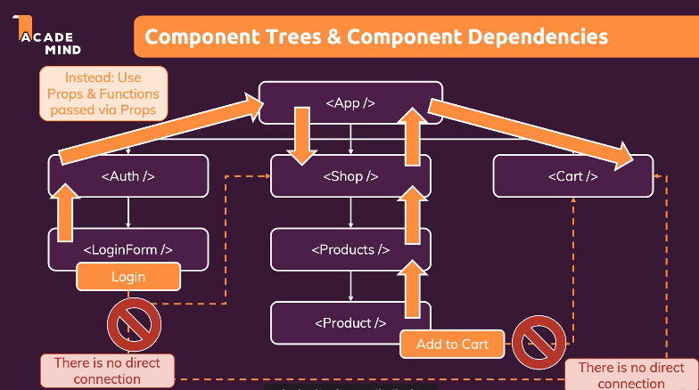
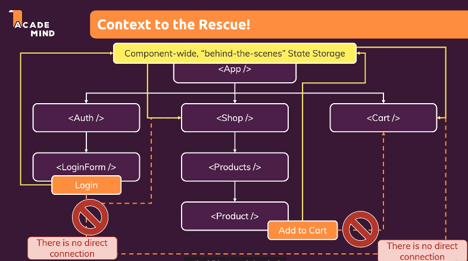

# [Udemy] Prefect REACT Guide (with Redux, Next.js, TypeScript)

---

## Section 8. Effects, Reducers & Context
#### Advanced, yet super-important Features!

8-1 Effect

8-2 Reducer

8-3 Context API 

---


## <span style='font-weight:700;background:#D3D3D3'>What to Learn</span>
##### < Module Content >
- Working with (Side) Effects 
- Manage more Complex State with Reducers 
- Managing App-Wide or Component-Wide State with Context (앱 수준 혹은 컴포넌트 수준에서의 state = 여러 개의 컴포넌트에 영향을 주는 state)
---

<br>

## <span style='font-weight:700;background:#D3D3D3'>Working with (Side) Effects </span>
### What is an "Effect" (or a "Side Effect")? 
* <strong>React App & React Library 의 Main Job : Render UI & React to User Input</strong>
    * Evaluate & Render JSX 
    * Manage State & Props
    * React to (User) Events & Input
    * Re-evaluate Component upon State & Prop Changes
    * <strong>This all 'baked into' React via the 'tools' and features covered in this course (i.e. useState() Hook, Props, etc)</strong>

* <strong>Side Effects: Anything Else</strong> (애플리케이션에서 일어나는 다른 모든 것, 이런 것들은 화면을 다루는 것과는 직접적인 관련이 없으며 Reat 를 필요로 하지 않는다)
    * Store Data in Browser Storage
    * Send Http Requests to Backend Servers
    * Set & Manage Timers
    * etc ...
    * <strong>These tasks must happen outside of the normal component evaluation and render cycle-especially since they might block/delay rendering (e.g. Http Requests)</strong>
    ```
    (예시1) Http Request 에 대한 응답으로 어떤 state 를 변경한다면 무한 루프에 빠질 수도 있다. (함수가 다시 실행될 때마마다 Request 를 보내면, Request 에 대한 응답으로 함수를 다시 트리거하는 State 를 변경하게 되므로)
    따라서 그러한 사이드이펙트는 직접적으로 컴포넌트 함수에 들어가서는 안된다. 버그나 무한 루프가 발생할 가능성이 높기 때문이다.
    ```
    ```
    (예시2) App 하나를 실행하기 위해 너무 많은 Http Request 가 보내질 수도 있다.
    ```
* <strong>따라서 Side Effect 를 처리하기 위한 더 좋은 도구가 필요하다 :useEffect (React Hook)</strong>

<br>

### Handling Side Effects with the useEffect() Hook
* useEffect
    * 내장 Hook 
    * ```useEffect(() => { ... }, [ dependencies] )```
    두 개의 매개변수(혹은 인수)와 같이 호출된다
        1) 함수 : A function that should be executed AFTER every component evaluation IF the specified dependencies changed (지정된 의존성이 변경된 경우, 모든 컴포넌트가 평가된 후에 실행되어야 하는 함수)
        <strong>Your side effect code goes into this function</strong>
        2) 지정된 의존성 : Dependencies of this effect - the function only runs if the dependencies changed (의존성으로 구성된 배열)
        <strong>Specify your dependencies of your function here</strong>
    * 즉, 컴포넌트가 다시 렌더링될 때 X , 지정한 의존성이 변경되는 경우에만 특정 코드가 실행된다 


<br>

---

### <예시 1 : 로그인 여부 체크>
* <strong>useEffect 를 사용하여 아래 처리를 한다</strong>
    * [로그인] 클릭 시, 로그인된다
    * 페이지 새로고침시, 로그인 State (isLoggedIn) 가 사라진다
    React가 JavaScript 변수로 관리하고 있으므로, 본질적으로 App 이 다시 로드될 때 전체 React 스크립트가 다시 시작되며, 따라서 최근 실행에서 얻은모든 변수가 사라진다.
    * 데이터를 저장할 곳이 필요하다 -> 앱이 시작될 때마다 데이터가 유지되었는지 확인한 다음, 다시 정보를 입력하여 로그인하지 않아도 자동으로 로그인시키게끔 할 것

1) Browser 에는 사용간으한 저장소가 여러 개 있다 : Cookie, Local Storage 
로그인 여부 정보를 local stroage 에 저장해서 새로고침해도 로그인 여부를 불러올 수 있게끔 한다. 
<strong>문제점</strong> : 무한루프에 빠진다. 새로고침시 local storage 에서 가져온 값을 확인하고 저장되어 있으면 State 를 true 로 설정.
state 설정 함수 (setIsLoggedIn) 을 호출할 때마다 이 컴포넌트 함수는 재실행된다.
위의 과정을 계속해서 반복한다.
<strong>해결</strong> : 언제 실행될지 제어하기 위해 useEffect 를 사용

```js
import React, { useState } from 'react';

import Login from './components/Login/Login';
import Home from './components/Home/Home';
import MainHeader from './components/MainHeader/MainHeader';

function App() {
  const [isLoggedIn, setIsLoggedIn] = useState(false);

  const storedUserLoggedInformation = localStorage.getItem('isLoggedIn')

  if (storedUserLoggedInformation === '1') {
    setIsLoggedIn(true)
  }

  const loginHandler = (email, password) => {
    // We should of course check email and password
    // But it's just a dummy/ demo anyways
    localStorage.setItem('isLoggedIn', '1')
    setIsLoggedIn(true);
  };

  const logoutHandler = () => {
    setIsLoggedIn(false);
  };

  return (
    <React.Fragment>
      <MainHeader isAuthenticated={isLoggedIn} onLogout={logoutHandler} />
      <main>
        {!isLoggedIn && <Login onLogin={loginHandler} />}
        {isLoggedIn && <Home onLogout={logoutHandler} />}
      </main>
    </React.Fragment>
  );
}

export default App;
```

2) useEffect 의 첫 번째 매개변수로 전달된 함수들은 <strong>모든 컴포넌트 재평가 이후에 React 에 의해 실행</strong>된다. 즉, 컴포넌트 함수가 실행된 후에 실행된다.
하지만 모든 컴포넌트 평가 후 실행되는 것은 아니다. 두 번째 매개변수로 전달된 의존성이 변경된 경우에만 실행된다. (예 : 앱을 처음 시작하는 경우 - 컴포넌트 함수가 처음 실행되면, 의존성이 없는 상태에서 있는 상태로 변경되기 때문에 의존성이 변경된 것으로 간주된다. 이 예제에서는 두 번째 매개변수가 빈 배열(없음)이므로, 의존성은 없다. 따라서 이 익명 함수는 실제로 앱이 처음 시작될 때 한 번만 실행된다. 의존성이 없기 떄문에 그 이후로 의존성은 절대 변경되지 않기 때문이다. 

```js
import React, { useState } from 'react';

import Login from './components/Login/Login';
import Home from './components/Home/Home';
import MainHeader from './components/MainHeader/MainHeader';
import { useEffect } from 'react/cjs/react.production.min';

function App() {
  const [isLoggedIn, setIsLoggedIn] = useState(false);

  useEffect(() => {
    const storedUserLoggedInformation = localStorage.getItem('isLoggedIn')

    if (storedUserLoggedInformation === '1') {
      setIsLoggedIn(true)
    }
  }, [])
  
  const loginHandler = (email, password) => {
    // We should of course check email and password
    // But it's just a dummy/ demo anyways
    localStorage.setItem('isLoggedIn', '1')
    setIsLoggedIn(true);
  };
  
  const logoutHandler = () => {
    setIsLoggedIn(false);
  };

  return (
    <React.Fragment>
      <MainHeader isAuthenticated={isLoggedIn} onLogout={logoutHandler} />
      <main>
        {!isLoggedIn && <Login onLogin={loginHandler} />}
        {isLoggedIn && <Home onLogout={logoutHandler} />}
      </main>
    </React.Fragment>
  );
}

export default App;
```

<br>

---

### <예시 2 : 유효성 검사>

* <strong>useEffect 를 사용하여 아래 처리를 한다</strong>
    * emailChangeHandler, passwordChangeHandler 가 실행되면 입력값에 대한 유효성 검사 실행
    * sideEffect 의 함수에서 사용하는 값을 의존성으로 추가하자!

  1) 이메일 및 비밀번호 변경 핸들러 각각에서 유효성 검사를 하는 대신, useEffect 를 사용하여 한 곳에서 하나의 로직으로 유효성 검사를 시행할 수 있다. 이 때, 이메일이나 비밀번호가 변경될때마다 트리거되게끔 한다 (의존성 = 이메일 입력값, 비밀번호 입력값)

```js
import React, { useState } from 'react';

import Card from '../UI/Card/Card';
import classes from './Login.module.css';
import Button from '../UI/Button/Button';

const Login = (props) => {
  const [enteredEmail, setEnteredEmail] = useState('');
  const [emailIsValid, setEmailIsValid] = useState();
  const [enteredPassword, setEnteredPassword] = useState('');
  const [passwordIsValid, setPasswordIsValid] = useState();
  const [formIsValid, setFormIsValid] = useState(false);

  const emailChangeHandler = (event) => {
    setEnteredEmail(event.target.value);

    setFormIsValid(
      event.target.value.includes('@') && enteredPassword.trim().length > 6
    );
  };

  const passwordChangeHandler = (event) => {
    setEnteredPassword(event.target.value);

    setFormIsValid(
      event.target.value.trim().length > 6 && enteredEmail.includes('@')
    );
  };

  const validateEmailHandler = () => {
    setEmailIsValid(enteredEmail.includes('@'));
  };

  const validatePasswordHandler = () => {
    setPasswordIsValid(enteredPassword.trim().length > 6);
  };

  const submitHandler = (event) => {
    event.preventDefault();
    props.onLogin(enteredEmail, enteredPassword);
  };

  return (
    <Card className={classes.login}>
      <form onSubmit={submitHandler}>
        <div
          className={`${classes.control} ${
            emailIsValid === false ? classes.invalid : ''
          }`}
        >
          <label htmlFor="email">E-Mail</label>
          <input
            type="email"
            id="email"
            value={enteredEmail}
            onChange={emailChangeHandler}
            onBlur={validateEmailHandler}
          />
        </div>
        <div
          className={`${classes.control} ${
            passwordIsValid === false ? classes.invalid : ''
          }`}
        >
          <label htmlFor="password">Password</label>
          <input
            type="password"
            id="password"
            value={enteredPassword}
            onChange={passwordChangeHandler}
            onBlur={validatePasswordHandler}
          />
        </div>
        <div className={classes.actions}>
          <Button type="submit" className={classes.btn} disabled={!formIsValid}>
            Login
          </Button>
        </div>
      </form>
    </Card>
  );
};

export default Login;
```

<br>

* 아래 useEffect 의 의미 : 리액트에게 다음과 같이 명령
=> 모든 Login Component의 함수 실행 후에 이 useEffect 의 함수 (두 번째 인자로 전달된 함수들)를 실행하라. 이 때, 첫 번째 인자로 전달된 setFormIsValid, enteredEmail, enteredPassword 가 마지막 컴포넌트 렌더링 주기에서 변경된 경우에만 실행하라. 이 셋 중 하나도 변경된 것이 없으면 이 useEffect 함수는 다시 실행되지 않음

* 중요 : setformIsValid 전달 시, 실행 (setFormIsValid()) 하지 않아야 한다. 실행하면 그 결과가 의존성으로 추가된다. 따라서 괄호를 붙여 실행하지 않고 함수의 포인터를 추가하면, 본직적으로 함수 그 자체를 의존성으로 추가하게 된다.

* setFormIsValid 는 생략할 수 있다. state update 함수는 기본적으로 리액트에 의해 절대 변경되지 않도록 보장되기 때문. 따라서 이러한 함수들은 재렌더링 주기에 따라 변하지 않으므로 생략할 수 있다. 


```js
// Login Component
import React, { useState, useEffect } from 'react';

import Card from '../UI/Card/Card';
import classes from './Login.module.css';
import Button from '../UI/Button/Button';

const Login = (props) => {
  const [enteredEmail, setEnteredEmail] = useState('');
  const [emailIsValid, setEmailIsValid] = useState();
  const [enteredPassword, setEnteredPassword] = useState('');
  const [passwordIsValid, setPasswordIsValid] = useState();
  const [formIsValid, setFormIsValid] = useState(false);

  useEffect(() => {
    enteredEmail.includes('@') && enteredPassword.trim().length > 6
  }, [setFormIsValid, enteredEmail, enteredPassword])
  

  const emailChangeHandler = (event) => {
    setEnteredEmail(event.target.value);
  };

  const passwordChangeHandler = (event) => {
    setEnteredPassword(event.target.value);
  };

  const validateEmailHandler = () => {
    setEmailIsValid(enteredEmail.includes('@'));
  };

  const validatePasswordHandler = () => {
    setPasswordIsValid(enteredPassword.trim().length > 6);
  };

  const submitHandler = (event) => {
    event.preventDefault();
    props.onLogin(enteredEmail, enteredPassword);
  };

  return (
    <Card className={classes.login}>
      <form onSubmit={submitHandler}>
        <div
          className={`${classes.control} ${
            emailIsValid === false ? classes.invalid : ''
          }`}
        >
          <label htmlFor="email">E-Mail</label>
          <input
            type="email"
            id="email"
            value={enteredEmail}
            onChange={emailChangeHandler}
            onBlur={validateEmailHandler}
          />
        </div>
        <div
          className={`${classes.control} ${
            passwordIsValid === false ? classes.invalid : ''
          }`}
        >
          <label htmlFor="password">Password</label>
          <input
            type="password"
            id="password"
            value={enteredPassword}
            onChange={passwordChangeHandler}
            onBlur={validatePasswordHandler}
          />
        </div>
        <div className={classes.actions}>
          <Button type="submit" className={classes.btn} disabled={!formIsValid}>
            Login
          </Button>
        </div>
      </form>
    </Card>
  );
};

export default Login;
```

<br>

#### 종속성으로 추가할 항목 및 추가하지 않을 항목
이전 강의에서 useEffect() 종속성에 대해 살펴보았습니다.

effect 함수에서 사용하는 "모든 것"을 종속성으로 추가해야 함을 배웠습니다. 즉, 거기에서 사용하는 모든 상태 변수와 함수를 포함합니다.

맞는 말이지만 몇 가지 예외가 있습니다. 다음 사항을 알고 있어야 합니다.

여러분은 상태 업데이트 기능을 추가할 필요가 없습니다. (지난 강의에서 했던 것처럼 setFormIsValid 사용): React는 해당 함수가 절대 변경되지 않도록 보장하므로 종속성으로 추가할 필요가 없습니다.

여러분은 또한 "내장" API 또는 함수를 추가할 필요가 없습니다 fetch(), 나 localStorage 같은 것들 말이죠 (브라우저에 내장된 함수 및 기능, 따라서 전역적으로 사용 가능): 이러한 브라우저 API/전역 기능은 React 구성 요소 렌더링 주기와 관련이 없으며 변경되지 않습니다.

여러분은 또한 변수나 함수를 추가할 필요가 없습니다. 아마도 구성 요소 외부에서 정의했을 겁니다 (예: 별도의 파일에 새 도우미 함수를 만드는 경우): 이러한 함수 또는 변수도 구성 요소 함수 내부에서 생성되지 않으므로 변경해도 구성 요소에 영향을 주지 않습니다 (해당 변수가 변경되는 경우, 또는 그 반대의 경우에도 구성 요소는 재평가되지 않습니다)

간단히 말해서: effect 함수에서 사용하는 모든 "것들"을 추가해야 합니다. 구성 요소(또는 일부 상위 구성 요소)가 다시 렌더링 되어 이러한 "것들"이 변경될 수 있는 경우.그렇기 때문에 컴포넌트 함수에 정의된 변수나 상태, 컴포넌트 함수에 정의된 props 또는 함수는 종속성으로 추가되어야 합니다!

다음은 위에서 언급한 시나리오를 더 명확히 하기 위해 구성된 더미 예입니다.
```js
import { useEffect, useState } from 'react';
 
let myTimer;
 
const MyComponent = (props) => {
  const [timerIsActive, setTimerIsActive] = useState(false);
 
  const { timerDuration } = props; // using destructuring to pull out specific props values
 
  useEffect(() => {
    if (!timerIsActive) {
      setTimerIsActive(true);
      myTimer = setTimeout(() => {
        setTimerIsActive(false);
      }, timerDuration);
    }
  }, [timerIsActive, timerDuration]);
};
```

* ```timerIsActive``` 는 종속성으로 추가되었습니다. 왜냐하면 구성 요소가 변경될 때 변경될 수 있는 구성 요소 상태이기 때문이죠(예: 상태가 업데이트되었기 때문에)

* ```timerDuration``` 은 종속성으로 추가되었습니다. 왜냐하면 해당 구성 요소의 prop 값이기 때문입니다 - 따라서 상위 구성 요소가 해당 값을 변경하면 변경될 수 있습니다(이 MyComponent 구성 요소도 다시 렌더링되도록 함).

* ```setTimerIsActive``` 는 종속성으로 추가되지 않습니다. 왜냐하면예외 조건이기 때문입니다: 상태 업데이트 기능을 추가할 수 있지만 React는 기능 자체가 절대 변경되지 않음을 보장하므로 추가할 필요가 없습니다.

* ```myTimer``` 는 종속성으로 추가되지 않습니다. 왜냐하면 그것은 구성 요소 내부 변수가 아니기 때문이죠. (즉, 어떤 상태나 prop 값이 아님) - 구성 요소 외부에서 정의되고 이를 변경합니다(어디에서든). 구성 요소가 다시 평가되도록 하지 않습니다.

* ```setTimeout``` 은 종속성으로 추가되지 않습니다 왜냐하면 그것은 내장 API이기 때문입니다. (브라우저에 내장) - React 및 구성 요소와 독립적이며 변경되지 않습니다.


<br>

### usEffect 에서 Cleanup 함수 사용
키가 입력될 때마다 useEffect 내의 함수를 실행했을 때, 문제가 될 수 있다.
현재 우리 코드같이 간단한 작업을 했을때에는 괜찮을 수 있지만, 백엔드 http 리퀘스트를 보내는 작업일 경우 (예: 해당 사용자 이름이 이미 사용인지 체크, 가입 여부 체크 등), 불필요한 네트워크 트래픽이 생기게 된다.
키가 입력될때마다 state 를 update 하는 것도 불필요한 작업이다. 
키가 입력될 때마다 하는 대신, 일정량의 키 입력을 수집하거나 또는 키 입력 후 일정 시간동안 일시중지 되는 것을 기다렸다가 중지시간이 충분히 긴 경우(예: 500ms) 에만 state 를 update 하는 것이 더 효율적이다. 
사용자가 다 입력한 것 같으니, 유효한지 확인하는 것. 
이를 Debouncing 이라고 한다. 사용자 입력을 디바운스(그룹화)하는 것.
이는 useEffect + setTimeout 을 이용하면 구현하기 쉽다. 

<br>
(1) 기존 코드
```js
useEffect(() => {
  setFormIsValid(
    enteredEmail.includes('@') && enteredPassword.trim().length > 6
  );
}, [enteredEmail, enteredPassword])
```

<br>
2. setTimeout 적용 : { } 내의 함수를 실행하기 전에 500ms 초를 기다린다 
```js
useEffect(() => {
  setTimeout(() => { 
    setFormIsValid(
    enteredEmail.includes('@') && enteredPassword.trim().length > 6
  );
  }, 500); 
}, [enteredEmail, enteredPassword])
```

<br>
3. 타이머 저장 : 타이머가 한 번에 하나만 실행되게끔 한다. 사용자가 계속 입력하면 다른 모든 타이머는 계속 지워진다. 마지막 타이머만 완료된다. 그 타이머는 500ms 후에 완료된다. 즉 사용자가 새로 키를 입력하여 타이머를 다시 시작하기전까지는 지연된다. 
useEffect 함수에서 첫 번째 인자로 전달하는 구체적인 무언가를 반환할 수 있다 (예: 함수, 익명 화살표 함수 등) <br>
cleanup 함수 : useEffect 함수가 실행되기 직전에 (처음 실행되는 경우 제외) cleanup 함수를 실행한다. 또한 이 함수는 effect 를 특정한 컴포넌트가 DOM 에서 마운트 해제될때마다 실행된다. (=컴포넌트가 재사용될 때 마다)
즉, cleanup 함수는 모든 새로운 side effect 함수가 실행되기 전에, 컴포넌트가 제거되기 전에 실행된다. 그리고 첫 번째 side effect 함수가 실행되기 전에는 실행되지 않는다. (그 이후에는 실행됨) <br>

```js
useEffect(() => {
  const identifier = setTimeout(() => { 
    setFormIsValid(
    enteredEmail.includes('@') && enteredPassword.trim().length > 6
  );
  }, 500); // { } 내의 함수를 실행하기 전에 500ms 초를 기다린다 

  return () => { 
    clearTimeout(identifier)
  }; // cleanup function 
}, [enteredEmail, enteredPassword])
```

<br>

### SUMMARY - useEffect
<br>

(1) 모든 컴포넌트 렌더링 주기 이후 (이전X, 도중X) 실행된다 (컴포넌트가 처음 마운트 됐을 때 포함) <br>
위의 Login Component 라면, 
새로 고침 후 처음 마운트 됐을 때 : O
키 입력 시 : O
Login Button 클릭 시 : O
```js
useEffect(() => {
  console.log('EFFECT RUNNING')
})
```

<br>

(2) 컴포넌트가 처음 마운트되고 렌더링될때만 실행된다. 이후의 렌더링 주기에는 실행되지 않는다 
새로 고침 후 처음 마운드 됐을 때 : O 
키 입력 시 : X
Login Button 클릭 시 : X
```js
useEffect(() => {
  console.log('EFFECT RUNNING')
}, [])
```

<br>

(3) 컴포넌트가 재평가 (re-evaluation) 될 때마다, 인자로 전달된 state 가 변경될때마다 재실행된다 
새로 고침 후 처음 마운드 됐을 때 : O 
email 키 입력 시 : X 
password 키 입력 시 : O 
Login Button 클릭 시 : O 
```js
useEffect(() => {
  console.log('EFFECT RUNNING')
}, [enteredPassword])
```

<br>

(3) cleanup 함수는 useEffect 의 함수가 전체적으로 실행되기 전에 실행된다. 그러나 처음 실행되기 전에는 실행되지 않는다 
새로 고침 후 처음 마운드 됐을 때 : X
email 키 입력 시 : X 
password 키 입력 시 : O  (EFFECT 내의 함수가 실행되기 전에 실행된다)
Login Button 클릭 시 : O (로그인하고 컴포넌트가 DOM 에서 제거되면 실행된다)
```js
useEffect(() => {
  console.log('EFFECT RUNNING')
  return () => {
    console.log('EFFECT CLEANUP')
  } 
}, [enteredPassword])
```

<br>

## <span style='font-weight:700;background:#D3D3D3'>Introducing useReducer() for State Management</span>

### Introducing useReducer()
* React 내장 Hook
* state 관리를 돕는다 (=> useState 와 비슷)
* 더 복잡한 state 에 특히 유용 
Sometimes, you have <strong>more complex state</strong>-for example if it got <strong>multiple states, multiple ways of changing</strong> it or <strong>dependencies</strong> to other states 
=> 
useState() then often <strong>becomes hard or error-prone-to-use</strong>-it's easy to write bad, inefficient or buggy code in such scenarios 
=>
useReducer() can be used as a <strong>replacement</strong> for useState() if you need "<strong>more powerful state management</strong>"

<br>

### Understanding useReducer()

#### 구조

```const [state, dispatchFn] = useReducer(reducerFn, initialState, initFn)```

* useState, useReducer 는 항상 두 개의 값이 있는 배열을 반환한다 => 배열 구조분해 (distructuring) 를 통해 값들을 추출해 별도의 상수에 저장 가능 
* ```state``` : 최신 state 스냅샷
  The <strong>state snapshot</strong> used in the component re-rdner / re-evaluation cycle 
* ```dispatchFn``` : 최신 state 스냅샷을 업데이트할 수 있게 해주는 함수
  A function that can be used to <strong>dispatch a new action</strong> (i.e. trigger an update of the state)
  -> useState 와 비슷하지만, 차이점 : 새로운 state 값을 설정하는 대신 action 을 dispatch. 그 action 은 useReducer 의 첫 번째 인수(reducerFn, 아래)가 소비한다. 
* ```reducerFn``` : 리듀서 함수
  (1) 최신 state snapshot 을 자동으로 가져온다. 리액트는 새 액션이 디스패치될 때마다 이 리듀서 함수를 호출하기 때문에 리액트가 호출하면 디스패치된 액션을 가져온다. 그러면 이 함수는 리액트가 관리하는 최신 state snapshot 을 가져온다. 그리고 이 리듀서 함수 실행을 트리거하는 디스패치된 액션을 가져온다. 
  (2) 새로 업데이트된 state 를 반환 
  (prevState, action) => newState
  A function that is <strong>triggered automatically</strong> once an action is <strong>dispatched</strong> (via dispatchFn()) - it <strong>receives the latest state snapshot</strong> and <strong>should return the new, updated state</strong>
  -> useState 의 확장된 버전이라고 보면 된다 (action 이 추가됨)
* ```initialState``` : 초기 state 
  The initial state
* ```initFn``` : 초기 state 설정 함수
  A function to set the initial state programmatically 

<br>

#### 사용 예제
* 입력값과 유효성을 결합하기 위해 사용 가능 (예: enteredEmail + isEmailValid)
* 전체 form state 관리하기 위해 사용 가능 (모든 state 가 들어있는 큰 form state 1개 또는 작은 state 여러 개로 관리)

<br>

입력값과 유효성을 하나의 state 로 결합하여 useReducer 로 관리 

(1) 기존 코드

```js
import React, { useState, useEffect, useReducer } from 'react';

import Card from '../UI/Card/Card';
import classes from './Login.module.css';
import Button from '../UI/Button/Button';

const emailReducer = (state, action) => { 
  return { value: '', isValid: false }
}
// 컴포넌트 함수 바깥에 만들어짐 : 컴포넌트 함수 내부에서 만들어진 데이터가 불필요하기 때문 (상호작용X)
// 인자 : 최신 state snapshot, dispatched action 

const Login = (props) => {
  const [enteredEmail, setEnteredEmail] = useState('');
  const [emailIsValid, setEmailIsValid] = useState();
  const [enteredPassword, setEnteredPassword] = useState('');
  const [passwordIsValid, setPasswordIsValid] = useState();
  const [formIsValid, setFormIsValid] = useState(false);

  const [emailState, dispatchEmail] = useReducer(emailReducer, { value: '', isValid: false }, third)

  // useEffect(() => {
  //   const identifier = setTimeout(() => { 
  //   setFormIsValid(
  //     enteredEmail.includes('@') && enteredPassword.trim().length > 6
  //   );
  //   }, 500); // { } 내의 함수를 실행하기 전에 500ms 초를 기다린다 

  //   return () => { 
  //     clearTimeout(identifier)
  //   }; // cleanup function 
  // }, [enteredEmail, enteredPassword])
  
  const emailChangeHandler = (event) => {
    setEnteredEmail(event.target.value);

    setFormIsValid(
      event.target.value.includes('@') && enteredPassword.trim().length > 6
    );
  };

  const passwordChangeHandler = (event) => {
    setEnteredPassword(event.target.value);

    setFormIsValid(
      emailState.value.includes('@') && event.target.value.trim().length > 6
    )
  };

  const validateEmailHandler = () => {
    setEmailIsValid(enteredEmail.includes('@'));
  };

  const validatePasswordHandler = () => {
    setPasswordIsValid(enteredPassword.trim().length > 6);
  };

  const submitHandler = (event) => {
    event.preventDefault();
    props.onLogin(enteredEmail, enteredPassword);
  };

  return (
    <Card className={classes.login}>
      <form onSubmit={submitHandler}>
        <div
          className={`${classes.control} ${
            emailIsValid === false ? classes.invalid : ''
          }`}
        >
          <label htmlFor="email">E-Mail</label>
          <input
            type="email"
            id="email"
            value={enteredEmail}
            onChange={emailChangeHandler}
            onBlur={validateEmailHandler}
          />
        </div>
        <div
          className={`${classes.control} ${
            passwordIsValid === false ? classes.invalid : ''
          }`}
        >
          <label htmlFor="password">Password</label>
          <input
            type="password"
            id="password"
            value={enteredPassword}
            onChange={passwordChangeHandler}
            onBlur={validatePasswordHandler}
          />
        </div>
        <div className={classes.actions}>
          <Button type="submit" className={classes.btn} disabled={!formIsValid}>
            Login
          </Button>
        </div>
      </form>
    </Card>
  );
};

export default Login;
```

<br>

(2) useEffect => useReducer 로 변경하여 emailState 를 그룹화하여 한 곳에서 관리할 수 있게끔 한다 
```js
import React, { useState, useReducer } from 'react';

import Card from '../UI/Card/Card';
import classes from './Login.module.css';
import Button from '../UI/Button/Button';

const emailReducer = (state, action) => { // 여기의 state 는 최신 state snapshot 임이 보장된다 (react 가 제공)
  if (action.type === 'USER_INPUT') {
    return { value: action.payload, isValid: action.payload.includes('@') }
  }
  if (action.type === 'INPUT_BLUR') {
    return { value: state.value, isValid: state.value.includes('@') }
  }

  return { value: '', isValid: false }
}
// 컴포넌트 함수 바깥에 만들어짐 : 컴포넌트 함수 내부에서 만들어진 데이터가 불필요하기 때문 (상호작용X)
// 인자 : 최신 state snapshot, dispatched action 

const Login = (props) => {
  // const [enteredEmail, setEnteredEmail] = useState('');
  // const [emailIsValid, setEmailIsValid] = useState();
  const [enteredPassword, setEnteredPassword] = useState('');
  const [passwordIsValid, setPasswordIsValid] = useState();
  const [formIsValid, setFormIsValid] = useState(false);

  const [emailState, dispatchEmail] = useReducer(emailReducer, {
    value: '', 
    isValid: null, 
  })

  const emailChangeHandler = (event) => {
    // setEnteredEmail(event.target.value);

    dispatchEmail({ type: 'USER_INPUT', payload: event.target.value }) 
    // dispatch Function 을 호출하여 state 값을 update 하고, action 에 전달
    // action 은 사용자가 정의할 수 있다. 형식은 자유이지만, 보통 객체.
    // 보통 다음과 같은 형식을 따른다 : { type: 식별자, paylod: 전달하고싶은 값 }
    // 그러면 useReducer 에 이 dispatchEmail 이라는 리듀서 함수를 전달했기 때문에
    // useReducer 에서 전달한 액션 = {type: 'USER_INPUT', val: '...'} 을 처리할 수 있다

    setFormIsValid(
      emailState.isValid && enteredPassword.trim().length > 6
    );
  };

  const passwordChangeHandler = (event) => {
    setEnteredPassword(event.target.value);

    setFormIsValid(
      emailState.value.includes('@') && event.target.value.trim().length > 6
    )
  };

  const validateEmailHandler = () => {
    // setEmailIsValid(emailState.isValid);

    dispatchEmail({ type: 'INPUT_BLUR' })
  };

  const validatePasswordHandler = () => {
    setPasswordIsValid(enteredPassword.trim().length > 6);
  };

  const submitHandler = (event) => {
    event.preventDefault();
    props.onLogin(emailState.value, enteredPassword);
  };

  return (
    <Card className={classes.login}>
      <form onSubmit={submitHandler}>
        <div
          className={`${classes.control} ${
            emailState.isValid === false ? classes.invalid : ''
          }`}
        >
          <label htmlFor="email">E-Mail</label>
          <input
            type="email"
            id="email"
            value={emailState.value}
            onChange={emailChangeHandler}
            onBlur={validateEmailHandler}
          />
        </div>
        <div
          className={`${classes.control} ${
            passwordIsValid === false ? classes.invalid : ''
          }`}
        >
          <label htmlFor="password">Password</label>
          <input
            type="password"
            id="password"
            value={enteredPassword}
            onChange={passwordChangeHandler}
            onBlur={validatePasswordHandler}
          />
        </div>
        <div className={classes.actions}>
          <Button type="submit" className={classes.btn} disabled={!formIsValid}>
            Login
          </Button>
        </div>
      </form>
    </Card>
  );
};

export default Login;

```

<br>

(3) 이메일, 비밀번호의 입력된 값과 유효성 <= useReducer 적용 (2에서 적용함)
form 유효성 <= useEffect 적용 (여기에서 적용)
```js
import React, { useState, useEffect, useReducer } from 'react';

import Card from '../UI/Card/Card';
import classes from './Login.module.css';
import Button from '../UI/Button/Button';

const emailReducer = (state, action) => { // 여기의 state 는 최신 state snapshot 임이 보장된다 (react 가 제공)
  if (action.type === 'USER_INPUT') {
    return { value: action.payload, isValid: action.payload.includes('@') }
  }
  if (action.type === 'INPUT_BLUR') {
    return { value: state.value, isValid: state.value.includes('@') }
  }
  return { value: '', isValid: false }
}

const passwordReducer = (state, action) => {
  if (action.type === 'USER_INPUT') {
    return { value: action.payload, isValid: action.payload.trim().length > 6 }
  }
  if (action.type === 'INPUT_BLUR') {
    return { value: state.value, isValid: state.value.trim().length > 6 }
  }
  return { value: '', isValid: false }
}
// 컴포넌트 함수 바깥에 만들어짐 : 컴포넌트 함수 내부에서 만들어진 데이터가 불필요하기 때문 (상호작용X)
// 인자 : 최신 state snapshot, dispatched action 

const Login = (props) => {
  // const [enteredEmail, setEnteredEmail] = useState('');
  // const [emailIsValid, setEmailIsValid] = useState();
  // const [enteredPassword, setEnteredPassword] = useState('');
  // const [passwordIsValid, setPasswordIsValid] = useState();
  const [formIsValid, setFormIsValid] = useState(false);

  const [emailState, dispatchEmail] = useReducer(emailReducer, {
    value: '', 
    isValid: null, 
  })

  const [passwordState, dispatchPassword] = useReducer(passwordReducer, {
    value: '',
    isValid: null, 
  })

  useEffect(() => {
    const identifier = setTimeout(() => { 
    setFormIsValid(
      emailState.isValid && passwordState.isValid
    );
    }, 500); 

    return () => { 
      clearTimeout(identifier)
    }; 
  }, [emailState, passwordState])

  const emailChangeHandler = (event) => {
    // setEnteredEmail(event.target.value);

    dispatchEmail({ type: 'USER_INPUT', payload: event.target.value }) 
    // dispatch Function 을 호출하여 state 값을 update 하고, action 에 전달
    // action 은 사용자가 정의할 수 있다. 형식은 자유이지만, 보통 객체.
    // 보통 다음과 같은 형식을 따른다 : { type: 식별자, paylod: 전달하고싶은 값 }
    // 그러면 useReducer 에 이 dispatchEmail 이라는 리듀서 함수를 전달했기 때문에
    // useReducer 에서 전달한 액션 = {type: 'USER_INPUT', val: '...'} 을 처리할 수 있다

    setFormIsValid(
      emailState.isValid && passwordState.isValid
    );
  };

  const passwordChangeHandler = (event) => {
    // setEnteredPassword(event.target.value);
    dispatchPassword({ type: 'USER_INPUT', payload: event.target.value })

    setFormIsValid(
      emailState.value.includes('@') && event.target.value.trim().length > 6
    )
  };

  const validateEmailHandler = () => {
    // setEmailIsValid(emailState.isValid);
    dispatchEmail({ type: 'INPUT_BLUR' })
  };

  const validatePasswordHandler = () => {
    // setPasswordIsValid(enteredPassword.trim().length > 6);
    dispatchPassword({ type: 'INPUT_BLUR' })
  };

  const submitHandler = (event) => {
    event.preventDefault();
    props.onLogin(emailState.value, passwordState.value);
  };

  return (
    <Card className={classes.login}>
      <form onSubmit={submitHandler}>
        <div
          className={`${classes.control} ${
            emailState.isValid === false ? classes.invalid : ''
          }`}
        >
          <label htmlFor="email">E-Mail</label>
          <input
            type="email"
            id="email"
            value={emailState.value}
            onChange={emailChangeHandler}
            onBlur={validateEmailHandler}
          />
        </div>
        <div
          className={`${classes.control} ${
            passwordState.isValid === false ? classes.invalid : ''
          }`}
        >
          <label htmlFor="password">Password</label>
          <input
            type="password"
            id="password"
            value={passwordState.value}
            onChange={passwordChangeHandler}
            onBlur={validatePasswordHandler}
          />
        </div>
        <div className={classes.actions}>
          <Button type="submit" className={classes.btn} disabled={!formIsValid}>
            Login
          </Button>
        </div>
      </form>
    </Card>
  );
};

export default Login;
```

<br>

(4) 값만 변경되고 유효성은 변경되지 않은 경우, useEffect 실행되지 않게끔 수정
=> 처음 입력시에는 실행. 이후로는 입력을 해도 유효성이 변경된 경우에만 실행
=> 유효성이 변경되어야 유효성 출력에서 추가 확인
위 코드에서의 문제점 : useEffect 의 코드가 너무 자주 실행됨
emailState 또는 passwordState 가 변경될 때마다 실행된다. 
하지만 그 경우에는 값만 변경되는 경우도 있을 수 있다.
여기서 우리가 관심있는 것은 유효성 뿐이다. 
현재는 값이 변경될 때마다 유효성도 업데이트된다. 
예를 들어, input 에 입력된 값이 이미 유효한데, 비밀번호에 문자를 몇 개 더 추가한 경우라면 실질적으로 유효성을 변하지 않고 여전히 유효하다. 
그럼에도 불구하고 useEffect 의 함수는 다시 실행된다. 
여기서 useEffect 가 실행되지 않는 것이 맞다. 왜냐하면 의존성은 emailState 및 passwordState 전체이지, 유효성 부분이 아니기 때문이다.
여기에서 사용할 기술 : object destrucutring (객체 구조분해) 
array destructuring (배열 구조분해) 와 비슷하다.

```js
  const { isValid: emailIsValid } = emailState       // object destructuring + 별칭 할당(alias assignment)   <-> * 값 할당 (value assignment)
  const { isValid: passwordIsValid } = passwordState  // object destructuring + 별칭 할당(alias assignment)

  useEffect(() => {
    const identifier = setTimeout(() => { 
    setFormIsValid(
      emailIsValid && passwordIsValid
    );
    }, 500); 

    return () => { 
      clearTimeout(identifier)
    }; 
  }, [emailIsValid, passwordIsValid])
  ```

<br><br>

## 중첩 속성을 useEffect에 종속성으로 추가하기
이전 강의에서 우리는 ```useEffect()``` 에 객체 속성을 종속성으로 추가하기 위해 dstructuring을 사용했습니다.
```js
const { someProperty } = someObject;
useEffect(() => {
  // code that only uses someProperty ...
}, [someProperty]);
```
이것은 매우 일반적인 패턴 및 접근 방식이며, 이것이 제가 일반적으로 이 방식을 사용하는 이유이며 여기서 보여드리는 이유입니다(코스 내내 계속 사용할 것입니다).

핵심은 우리가 destructuring을 사용한다는 것이 아니라, 전체 개체 대신 특정 속성을 종속성으로 전달한다는 것입니다.

우리는 이와 같이 코드를 작성할 수도 있으며 같은 방식으로 작동합니다.
```js
useEffect(() => {
  // code that only uses someProperty ...
}, [someObject.someProperty]);
```
이것은 잘 작동합니다!

하지만 여러분은 이 코드 사용을 피해야 합니다:
```js
useEffect(() => {
  // code that only uses someProperty ...
}, [someObject]);
```
왜 그럴까요?

왜냐하면 effect 함수는 ```someObject``` 가 변경될 때마다 재실행되기 때문이죠 - 단일 속성이 아닙니다 (```someProperty``` 위의 예에서)

<br>

## <span style='font-weight:700;background:#D3D3D3'>useState() vs useReducer()</span>
Generally, you'll know when you need useReducer() (=> when using useState() becomes cumbersome or you're getting a lot of bugs / unintended behaviors)
* useState()
  * The main state management 'tool'
  * Great for independent pieces of state / data
  * Great if state updates are easy and limited to a few kinds of updates

* useReducer()
  * Great if you need 'more power' (=복잡한 state update logic 을 가진 reducer 함수를 사용할 수 있기 때문)
  * Should be considered if you have related pieces of state / data
  * Can be helpful if you have more complex state updates

<br><br>

## <span style='font-weight:700;background:#D3D3D3'>Context API</span>
로그인 state 는 애플리케이션의 다양한 곳에서 필요하거나 사용된다. 
state 를 prop 을 활용해 여러 컴포넌트를 통해 전달한다. 
하지만 여기에서 MainHeader 는 중간 전달자 역할만 할 뿐, 전달하는 모든 prop 을 전혀 사용하지 않는다. 
```js
function App() {
  const [isLoggedIn, setIsLoggedIn] = useState(false);

  useEffect(() => {
    const storedUserLoggedInformation = localStorage.getItem('isLoggedIn')

    if (storedUserLoggedInformation === '1') {
      setIsLoggedIn(true)
    }
  }, [])
  
  const loginHandler = (email, password) => {
    localStorage.setItem('isLoggedIn', '1')
    setIsLoggedIn(true);
  };
  
  const logoutHandler = () => {
    setIsLoggedIn(false);
  };

  return (
    <React.Fragment>
      <MainHeader isAuthenticated={isLoggedIn} onLogout={logoutHandler} />
      <main>
        {!isLoggedIn && <Login onLogin={loginHandler} />}
        {isLoggedIn && <Home onLogout={logoutHandler} />}
      </main>
    </React.Fragment>
  );
}

export default App;
```
애플리케이션이 크다면, 이런식으로 전달하는 경로가 점점 길어질 수 있다.
아래와 같은 prop chain (프롭 체인) 이 만들어진다.


이러한 문제를 해결하기 위해, 
리액트에 내장된, 내부적인 state 저장소 = React Context

prop chain 을 구축하지 않아도, 앱의 어떤 컴포넌트에서든 state 를 직접 변경할 수 있게 하고, 앱의 다른 컴포넌트에 직접 전달할 수 있게 한다

폴더명 : context 또는 store, ...
파일명 : auth-context.js
AuthContext 와 같이 파스칼 표기법으로 하면 이 파일에 컴포넌트를 저장한다는 뜻이므로 위와 같이 케밥 표기밥을 사용

(1) context 파일 생성 : src/store/auth-context.js
```js
import React from 'react'

const AuthContext = React.createContext({
    isLoggedIn: false, 
    onLogout: () => { }
})

export default AuthContext;
```

<br>

(2) 앱에서 컨텍스트 사용을 위한 작업 수행
* 컨텍스트 공급 
  => 컨텍스트를 활용할 수 있어야 하는 모든 컴포넌트를 JSX 코드로 감싸서 해당 컨텍스트를 리스닝할 수 있어야 한다 
  => 이 때 ```<AuthContext.Provider>``` 는 root component 로 사용 가능하다
  => 감싸진 Component 의 자식까지 AuthContext 에 접근 가능
* 컨텍스트 소비 
  => 값에 접근하려면 리스닝해야 한다 
    (1) AuthContext Consumer 사용
    (2) React Hook 사용 
```js 
// App.js
import AuthContext from './store/auth-context';

...

return (
    <AuthContext.Provider
      value={{
        isLoggedIn: isLoggedIn, 
        onLogout: logoutHandler, 
      }}
    >
      <MainHeader />
      <main>
        {!isLoggedIn && <Login onLogin={loginHandler} />}
        {isLoggedIn && <Home onLogout={logoutHandler} />}
      </main>
    </AuthContext.Provider>
  );
```

<br>

Consumer 사용 
isLoggedIn 이 변경될 때마다 리액트에 의해 Consumer 의 isLoggedIn 이 업데이트된다. 새로운 context 객체는 모든 listening component 로 전달된다. (= 이 context 를 소비하는 모든 컴포넌트에 전달된다) (소비하는 컴포넌트는 provider 에 의해 감싸져 있다)
=> 이렇게 수정하면 isLoggedIn 을 전달하기 위해 prop 을 사용할 필요가 없다. 공급자로 감싼 다음 공급자에 값을 설정하면 된다. 그러면 감싸진 컴포넌트 (와 그의 자식들까지) 에서 해당 값을 리스닝할 수 있다
```js
// components/MainHeader/Navigation.js 
import React from 'react';
import AuthContext from '../../store/auth-context';

import classes from './Navigation.module.css';

const Navigation = (props) => {
  return (
    <AuthContext.Consumer>
    {(context) => {
        return (
          <nav className={classes.nav}>
            <ul>
              {context.isLoggedIn && (
                <li>
                  <a href="/">Users</a>
                </li>
              )}
              {context.isLoggedIn && (
                <li>
                  <a href="/">Admin</a>
                </li>
              )}
              {context.isLoggedIn && (
                <li>
                  <button onClick={context.onLogout}>Logout</button>
                </li>
              )}
            </ul>
          </nav>
        )
    }}
    
      </AuthContext.Consumer>
  );
};

export default Navigation;
```

<br>

Consumer 보다 더 우아한 방법 : Context Hook 
```js
import React, { useContext } from 'react';
import AuthContext from '../../store/auth-context';

import classes from './Navigation.module.css';

const Navigation = (props) => {
  const context = useContext(AuthContext)
  
  return (
    <nav className={classes.nav}>
      <ul>
        {context.isLoggedIn && (
          <li>
            <a href="/">Users</a>
          </li>
        )}
        {context.isLoggedIn && (
          <li>
            <a href="/">Admin</a>
          </li>
        )}
        {context.isLoggedIn && (
          <li>
            <button onClick={context.onLogout}>Logout</button>
          </li>
        )}
      </ul>
    </nav>
  )
};

export default Navigation;
```

<br>

아래를 보면, 여전히 App Component 에서는 Login 과 Home component 에 prop 으로 login / logout 함수를 넘겨주고 있다. (엄밀히 말하면 Button Component 에)
context 를 사용하지 않은 이유는 이 둘이 순순한 presentation component 이기 때문이다. 버튼 클릭을 항상 onLogout 또는 onLogin 에 바인딩하기 위해 Button 내부에 Context 를 사용하면 비효율적이기 때문이다. 
```js
<MainHeader/>
<main>
  {!isLoggedIn && <Login onLogin={loginHandler} />}
  {isLoggedIn && <Home onLogout={logoutHandler} />}
</main>
```

<br>
<br>

독립 수행형 context file
(1) AuthContextProvider component 를 생성하여 export
(2) App 에서 AuthContext 관련 코드 모두 삭제
(3) Index.js 에서 App 컴포넌트를 AuthContextProvider 컴포넌트로 감싼다
=> state 를 관리하는 1개의 중심 장소를 생성하였다.
그 중심 장소는 App component 가 아닌, 전용 context component (=AuthContextProvider) 및 전용 context file (=auth-context.js) 이다
이렇게 Auth state 관리와 AuthContext 관리에 관한 코드가 한 곳에 모여 있기 때문에 App Component 가 간결해지며, 이제 애플리케이션 전체 state 관리와는 관련이 없어지기 때문에 유지보수에 유리해진다.
JSX 반환과 화면에 무언가를 가져와 보여주는 것에 집중할 수 있다. 
모든 컴포넌트는 기본적으로 하나의 임무만 갖게 하는 것이 좋다. 
```js 
// src/store/auth-context.js
import React, { useEffect, useState } from 'react'

const AuthContext = React.createContext({
    isLoggedIn: false, 
    onLogout: () => { },
    onLogin: (email, password) => { }
})

export const AuthContextProvider = (props) => {
    const [isLoggedIn, setIsLoggedIn] = useState(false)

    useEffect(() => {
        const storedUserLoggedInformation = localStorage.getItem('isLoggedIn')

        if (storedUserLoggedInformation === '1') {
        setIsLoggedIn(true)
        }
    }, [])

    const logoutHandler = () => {
        localStorage.removeItem('isLoggedIn')
        setIsLoggedIn(false)
    }

    const loginHandler = () => {
        localStorage.setItem('isLoggedIn', '1')
        setIsLoggedIn(true)
    }

    return <AuthContext.Provider 
                value={{
                    isLoggedIn: isLoggedIn,
                    onLogout: logoutHandler,
                    onLogin: loginHandler
                }}
            >
                {props.children}
            </AuthContext.Provider >
}

export default AuthContext;
```

```js
// src/index.js
import React from 'react';
import ReactDOM from 'react-dom';

import './index.css';
import App from './App';
import { AuthContextProvider } from './store/auth-context';

ReactDOM.render(
    <AuthContextProvider>
        <App />
    </AuthContextProvider>,
    document.getElementById('root')
);
```

```js
// src/App.js
import React, { useContext } from 'react';

import Login from './components/Login/Login';
import Home from './components/Home/Home';
import MainHeader from './components/MainHeader/MainHeader';
import AuthContext from './store/auth-context';

function App() {
  const context = useContext(AuthContext)

  return (
    <React.Fragment>
      <MainHeader/>
      <main>
        {!context.isLoggedIn && <Login />}
        {context.isLoggedIn && <Home />}
      </main>
    </React.Fragment>
  );
}

export default App;
```

```js
// src/components/Home/Home.js
import Reactm, { useContext } from 'react';
import AuthContext from '../../store/auth-context';
import Button from '../UI/Button/Button';

import Card from '../UI/Card/Card';
import classes from './Home.module.css';

const Home = (props) => {
  const context = useContext(AuthContext)

  return (
    <Card className={classes.home}>
      <h1>Welcome back!</h1>
      <Button onClick={context.onLogout}>Logout</Button>
    </Card>
  );
};

export default Home;
```

```js
// src/components/Login/Login.js
import React, { useState, useEffect, useReducer, useContext } from 'react';

import Card from '../UI/Card/Card';
import classes from './Login.module.css';
import Button from '../UI/Button/Button';
import AuthContext from '../../store/auth-context';

const emailReducer = (state, action) => { // 여기의 state 는 최신 state snapshot 임이 보장된다 (react 가 제공)
  if (action.type === 'USER_INPUT') {
    return { value: action.payload, isValid: action.payload.includes('@') }
  }
  if (action.type === 'INPUT_BLUR') {
    return { value: state.value, isValid: state.value.includes('@') }
  }
  return { value: '', isValid: false }
}

const passwordReducer = (state, action) => {
  if (action.type === 'USER_INPUT') {
    return { value: action.payload, isValid: action.payload.trim().length > 6 }
  }
  if (action.type === 'INPUT_BLUR') {
    return { value: state.value, isValid: state.value.trim().length > 6 }
  }
  return { value: '', isValid: false }
}
// 컴포넌트 함수 바깥에 만들어짐 : 컴포넌트 함수 내부에서 만들어진 데이터가 불필요하기 때문 (상호작용X)
// 인자 : 최신 state snapshot, dispatched action 

const Login = (props) => {
  const [formIsValid, setFormIsValid] = useState(false);

  const [emailState, dispatchEmail] = useReducer(emailReducer, {
    value: '', 
    isValid: null, 
  })

  const [passwordState, dispatchPassword] = useReducer(passwordReducer, {
    value: '',
    isValid: null, 
  })

  const authContext = useContext(AuthContext)

  const { isValid: emailIsValid } = emailState       // object destructuring + 별칭 할당(alias assignment)   <-> * 값 할당 (value assignment)
  const { isValid: passwordIsValid } = passwordState  // object destructuring + 별칭 할당(alias assignment)

  useEffect(() => {
    const identifier = setTimeout(() => { 
      console.log('checking validity')
      setFormIsValid(
      emailIsValid && passwordIsValid
    );
    }, 500); 

    return () => { 
      clearTimeout(identifier)
    }; 
  }, [emailIsValid, passwordIsValid])

  const emailChangeHandler = (event) => {
    dispatchEmail({ type: 'USER_INPUT', payload: event.target.value }) 
    // dispatch Function 을 호출하여 state 값을 update 하고, action 에 전달
    // action 은 사용자가 정의할 수 있다. 형식은 자유이지만, 보통 객체.
    // 보통 다음과 같은 형식을 따른다 : { type: 식별자, paylod: 전달하고싶은 값 }
    // 그러면 useReducer 에 이 dispatchEmail 이라는 리듀서 함수를 전달했기 때문에
    // useReducer 에서 전달한 액션 = {type: 'USER_INPUT', val: '...'} 을 처리할 수 있다
  };

  const passwordChangeHandler = (event) => {
    dispatchPassword({ type: 'USER_INPUT', payload: event.target.value })
  };

  const validateEmailHandler = () => {
    dispatchEmail({ type: 'INPUT_BLUR' })
  };

  const validatePasswordHandler = () => {
    dispatchPassword({ type: 'INPUT_BLUR' })
  };

  const submitHandler = (event) => {
    event.preventDefault();
    authContext.onLogin(emailState.value, passwordState.value);
  };

  return (
    <Card className={classes.login}>
      <form onSubmit={submitHandler}>
        <div
          className={`${classes.control} ${
            emailState.isValid === false ? classes.invalid : ''
          }`}
        >
          <label htmlFor="email">E-Mail</label>
          <input
            type="email"
            id="email"
            value={emailState.value}
            onChange={emailChangeHandler}
            onBlur={validateEmailHandler}
          />
        </div>
        <div
          className={`${classes.control} ${
            passwordState.isValid === false ? classes.invalid : ''
          }`}
        >
          <label htmlFor="password">Password</label>
          <input
            type="password"
            id="password"
            value={passwordState.value}
            onChange={passwordChangeHandler}
            onBlur={validatePasswordHandler}
          />
        </div>
        <div className={classes.actions}>
          <Button type="submit" className={classes.btn} disabled={!formIsValid}>
            Login
          </Button>
        </div>
      </form>
    </Card>
  );
};

export default Login;
```

<br><br>

## <span style='font-weight:700;background:#D3D3D3'>Context Limitations</span>
* context : 애플리케이션 또는 component 전체 state 에는 적합.
  즉, 기본적으로 여러 컴포넌트에 영향을 미치는 state 들에는 적합.
  하지만, component configuration (구성) 을 대체할 수는 없다
* React Context is <strong>NOT optimized</strong> for high frequency changes!
  변경이 잦은 경우에는 적합하지 않다!
* 그렇다면, '앱 전체에 걸쳐 또는 컴포넌트 전체에 걸쳐 state 가 자주 변경되는 경우에' 어떤 것을 사용할까?
  => <strong>Redux</strong>
<br>
* React Context also <strong>shouldn't be used to replace ALL</strong> component communications and props
  => Component should still be configurable via props and short "prop chains" might not need any replacement 
  프롭의 모든 커뮤니케이션을 대체하기 위해 context 나 redux 등을 사용해서는 안된다.
  프롭은 여전히 컴포넌트 구성에 있어 필수적이고 중요하다. 
  길고 비효율적인 prop chain 을 교체하기 위해서라면 context 나 redux 를 사용하자.

<br><br>

## <span style='font-weight:700;background:#D3D3D3'>Rules of Hooks</span>
* React Hook ? use 로 시작하는 모든 함수 
  i.e. useEffect, useReducer, useContext, ...
<br>
* (1) Only call React Hooks in <strong>React Functions</strong> 
  리액트 훅은 리액트 함수에서만 호출해야 한다
  * React Component Functions
  * Custom Hooks
  예를 들어, Login 컴포넌트에 emailRdeucer 함수가 있다. 
  Login 함수는 Login Component 에 대한 Component 함수이다. 마지막에 JSX 를 반환하므로 함수.
  하지만 emailReducer 는 객체를 반환하므로 React Component 가 아니다.
  따라서 emailReducer 내에서 useState 호출이 불가능하다
  ```js
  // Login.js

  const emailReducer = (state, action) => { // 여기의 state 는 최신 state snapshot 임이 보장된다 (react 가 제공)
  if (action.type === 'USER_INPUT') {
      return { value: action.payload, isValid: action.payload.includes('@') }
    }
    if (action.type === 'INPUT_BLUR') {
      return { value: state.value, isValid: state.value.includes('@') }
    }
    return { value: '', isValid: false }
  }

  const Login = (props) => {
    ...
  }
  ```
  <br>
* (2) Only call React Hooks at the <strong>Top Level</strong>
   리액트 훅은 리액트 컴포넌트 함수 또는 사용자 정의 훅 함수의 최상위 수준에서만 호출해야 한다
   * Don't call them <strong>in nested functions</strong> (중첩함수에서 X)
   * Don't call them <strong>in any block statements</strong> (block 문에서 X)
   예를 들어, Login Component 내의 useEffect 내에서 useContext 등의 호출이 불가능하다.
   그 외에 useEffect 외부의 위쪽 라인은 가능하다.
   중첩 함수 뿐만 아니라 if 문 내에서도 허용되지 않는다.
   ```js
   // Login.js
  const Login = (props) => {
    useEffect(() => {
      const identifier = setTimeout(() => { 
        console.log('checking validity')
        setFormIsValid(
        emailIsValid && passwordIsValid
      );
      }, 500); 

      return () => { 
        clearTimeout(identifier)
      }; 
    }, [emailIsValid, passwordIsValid])
  };
   ```
  <br>

* (3) extra, unofficial Rule to useEffect() : <strong>ALWAYS add everything you refer to insde of useEffect() as a dependency</strong>
참조하는 모든 항목을 의존성으로 useEffect 내부에 추가해야 한다 
  ```js
  useEffect(() => {
    const identifier = setTimeout(() => { 
      setFormIsValid(
        emailIsValid && passwordIsValid
      );
    }, 500); 

    return () => { 
      clearTimeout(identifier)
    }; 
  }, [emailIsValid, passwordIsValid])
  ```
  * dependencies : emailIsValid, passwordIsValid, setFormIsValid 
  * setFormIsValid 가 Browser API 가 아님에도 불구하고 추가하지 않은 이유 (예외적 상황) :
    useReducer 또는 useState 에 의해 노출된 state update 함수는 변경되지 않도록 React 가 보장한다
    따라서 의존성(dependency) 로 추가할 필요가 없다. (추가해도 문제되지는 않지만, 변하지 않으므로 불필요! 따라서 생략한다)
  * 이외에, Browser 에서 제공하지 않는 것, 컴포넌트 함수 외부에서 오는 데이터들, 
    즉, useEffect 를 사용하는 컴포넌트 함수 내부의 데이터들은 의존성 배열에 넣어야 한다  


<br><br>

---
### UI/Input Component 생성

```js
// UI/Input.js
import React from 'react'

import classes from './Input.module.css'

const Input = props => {
  return (
    <div
        className={`${classes.control} ${
          props.isValid === false ? classes.invalid : ''
        }`}
      >
      <label htmlFor={props.id}>{props.label}</label>
        <input
          type={props.type}
          id={props.id}
          value={props.value}
          onChange={props.onChange}
          onBlur={props.onBlur}
        />
      </div>
  )
}

export default Input
```

```js
// Login.js
import React, { useState, useEffect, useReducer, useContext } from 'react';

import Card from '../UI/Card/Card';
import classes from './Login.module.css';
import Button from '../UI/Button/Button';
import AuthContext from '../../store/auth-context';
import Input from '../UI/Input/Input';

const emailReducer = (state, action) => { // 여기의 state 는 최신 state snapshot 임이 보장된다 (react 가 제공)
  if (action.type === 'USER_INPUT') {
    return { value: action.payload, isValid: action.payload.includes('@') }
  }
  if (action.type === 'INPUT_BLUR') {
    return { value: state.value, isValid: state.value.includes('@') }
  }
  return { value: '', isValid: false }
}

const passwordReducer = (state, action) => {
  if (action.type === 'USER_INPUT') {
    return { value: action.payload, isValid: action.payload.trim().length > 6 }
  }
  if (action.type === 'INPUT_BLUR') {
    return { value: state.value, isValid: state.value.trim().length > 6 }
  }
  return { value: '', isValid: false }
}
// 컴포넌트 함수 바깥에 만들어짐 : 컴포넌트 함수 내부에서 만들어진 데이터가 불필요하기 때문 (상호작용X)
// 인자 : 최신 state snapshot, dispatched action 

const Login = (props) => {
  // const [enteredEmail, setEnteredEmail] = useState('');
  // const [emailIsValid, setEmailIsValid] = useState();
  // const [enteredPassword, setEnteredPassword] = useState('');
  // const [passwordIsValid, setPasswordIsValid] = useState();
  const [formIsValid, setFormIsValid] = useState(false);

  const [emailState, dispatchEmail] = useReducer(emailReducer, {
    value: '', 
    isValid: null, 
  })

  const [passwordState, dispatchPassword] = useReducer(passwordReducer, {
    value: '',
    isValid: null, 
  })

  const authContext = useContext(AuthContext)

  const { isValid: emailIsValid } = emailState       // object destructuring + 별칭 할당(alias assignment)   <-> * 값 할당 (value assignment)
  const { isValid: passwordIsValid } = passwordState  // object destructuring + 별칭 할당(alias assignment)

  useEffect(() => {
    const identifier = setTimeout(() => {
      setFormIsValid(emailIsValid && passwordIsValid)
    }, 500)
  
    return () => {
      clearTimeout(identifier)
    }
  }, [emailIsValid, passwordIsValid])
  

  const emailChangeHandler = (event) => {
    // setEnteredEmail(event.target.value);

    dispatchEmail({ type: 'USER_INPUT', payload: event.target.value }) 
    // dispatch Function 을 호출하여 state 값을 update 하고, action 에 전달
    // action 은 사용자가 정의할 수 있다. 형식은 자유이지만, 보통 객체.
    // 보통 다음과 같은 형식을 따른다 : { type: 식별자, paylod: 전달하고싶은 값 }
    // 그러면 useReducer 에 이 dispatchEmail 이라는 리듀서 함수를 전달했기 때문에
    // useReducer 에서 전달한 액션 = {type: 'USER_INPUT', val: '...'} 을 처리할 수 있다

    // setFormIsValid(
    //   emailState.isValid && passwordState.isValid
    // );
  };

  const passwordChangeHandler = (event) => {
    // setEnteredPassword(event.target.value);
    dispatchPassword({ type: 'USER_INPUT', payload: event.target.value })

    // setFormIsValid(
    //   emailState.value.includes('@') && event.target.value.trim().length > 6
    // )
  };

  const validateEmailHandler = () => {
    // setEmailIsValid(emailState.isValid);
    dispatchEmail({ type: 'INPUT_BLUR' })
  };

  const validatePasswordHandler = () => {
    // setPasswordIsValid(enteredPassword.trim().length > 6);
    dispatchPassword({ type: 'INPUT_BLUR' })
  };

  const submitHandler = (event) => {
    event.preventDefault();
    authContext.onLogin(emailState.value, passwordState.value);
  };

  return (
    <Card className={classes.login}>
      <form onSubmit={submitHandler}>
        <Input
          id="email"
          label="E-mail"
          type="email"
          isValid={emailIsValid}
          value={emailState.value}
          onChange={emailChangeHandler}
          onBlur={validateEmailHandler}
        />
        <Input
          id="password"
          label="Password"
          type="password"
          isValid={passwordIsValid}
          value={passwordState.value}
          onChange={passwordChangeHandler}
          onBlur={validatePasswordHandler}
        />
        <div className={classes.actions}>
          <Button type="submit" className={classes.btn} disabled={!formIsValid}>
            Login
          </Button>
        </div>
      </form>
    </Card>
  );
};

export default Login;
```

<br>

### Ref
* Input Component 와 명령형으로 상호작용할 수 있다
  => state 를 전달해어 component 에서 무언가를 변경하는 식이 아니라,
    컴포넌트 내부에서 함수를 호출하는 방식으로!
* 일반적인 React Pattern 이 아니므로 자주 사용해서는 안 되지만, 필요할 때 사용
<br>
1) Button 에서 ```disabled={!formIsValid}``` 속성 삭제
  버튼이 항상 클릭될 수 있게 활성화

```js
// Login.js
<Button type="submit" className={classes.btn}>
  Login
</Button>
```

2) Login 컴포넌트의 submitHandler 함수 수정
  폼이 유효한지 확인하고, 유효한 경우에만 onLogin 호출
  그렇지 않은 경우에는 유효하지 않은 Input focus

  ```useImperativeHandle``` : React Hook. 컴포넌트나 컴포넌트 내부에서 오는 기능들을 명령적으로 사용할 수 있게 한다. 
  즉, 일반적인 state prop 관리를 통해 하지 않고, 부모 컴포넌트의 state 를 통해 컴포넌트를 제어하지 않고 프로그래밍적으로 컴포넌트에서 무언가를 직접 호출하거나 조작해서 사용하게 한다 
  자주 사용하지는 않을 것. 

```js
// Login.js
import React, { useState, useEffect, useReducer, useContext, useRef } from 'react';

import Card from '../UI/Card/Card';
import classes from './Login.module.css';
import Button from '../UI/Button/Button';
import AuthContext from '../../store/auth-context';
import Input from '../UI/Input/Input';

const emailReducer = (state, action) => { 
  if (action.type === 'USER_INPUT') {
    return { value: action.payload, isValid: action.payload.includes('@') }
  }
  if (action.type === 'INPUT_BLUR') {
    return { value: state.value, isValid: state.value.includes('@') }
  }
  return { value: '', isValid: false }
}

const passwordReducer = (state, action) => {
  if (action.type === 'USER_INPUT') {
    return { value: action.payload, isValid: action.payload.trim().length > 6 }
  }
  if (action.type === 'INPUT_BLUR') {
    return { value: state.value, isValid: state.value.trim().length > 6 }
  }
  return { value: '', isValid: false }
}

const Login = (props) => {
  const [formIsValid, setFormIsValid] = useState(false);

  const [emailState, dispatchEmail] = useReducer(emailReducer, {
    value: '', 
    isValid: null, 
  })

  const [passwordState, dispatchPassword] = useReducer(passwordReducer, {
    value: '',
    isValid: null, 
  })

  const authContext = useContext(AuthContext)

  const emailInputRef = useRef()
  const passwordInputRef = useRef()

  const { isValid: emailIsValid } = emailState       
  const { isValid: passwordIsValid } = passwordState  

  useEffect(() => {
    const identifier = setTimeout(() => {
      setFormIsValid(emailIsValid && passwordIsValid)
    }, 500)
  
    return () => {
      clearTimeout(identifier)
    }
  }, [emailIsValid, passwordIsValid])
  

  const emailChangeHandler = (event) => {
    dispatchEmail({ type: 'USER_INPUT', payload: event.target.value }) 
  };

  const passwordChangeHandler = (event) => {
    dispatchPassword({ type: 'USER_INPUT', payload: event.target.value })
  };

  const validateEmailHandler = () => {
    dispatchEmail({ type: 'INPUT_BLUR' })
  };

  const validatePasswordHandler = () => {
    dispatchPassword({ type: 'INPUT_BLUR' })
  };

  const submitHandler = (event) => {
    event.preventDefault()
    if (formIsValid) {
      authContext.onLogin(emailState.value, passwordState.value);
    } else if (!emailIsValid) {
      emailInputRef.current.focus()
    } else {
      passwordInputRef.current.focus()
    }
  };

  return (
    <Card className={classes.login}>
      <form onSubmit={submitHandler}>
        <Input
          ref={emailInputRef}
          id="email"
          label="E-mail"
          type="email"
          isValid={emailIsValid}
          value={emailState.value}
          onChange={emailChangeHandler}
          onBlur={validateEmailHandler}
        />
        <Input
          ref={passwordInputRef}
          id="password"
          label="Password"
          type="password"
          isValid={passwordIsValid}
          value={passwordState.value}
          onChange={passwordChangeHandler}
          onBlur={validatePasswordHandler}
        />
        <div className={classes.actions}>
          <Button type="submit" className={classes.btn}>
            Login
          </Button>
        </div>
      </form>
    </Card>
  );
};

export default Login;
```

```js
// UI/Input.js
import React, { useRef, useImperativeHandle } from 'react'

import classes from './Input.module.css'

const Input = React.forwardRef((props, ref) => {
  const inputRef = useRef()

  const activate = () => {  // input 내부가 아니라 외부에서 호출
    inputRef.current.focus()
  }

  useImperativeHandle(ref, () => {
    return {
      focus: activate 
    }
  })
  
  return (
    <div
        className={`${classes.control} ${
          props.isValid === false ? classes.invalid : ''
        }`}
      >
      <label htmlFor={props.id}>{props.label}</label>
      <input
          ref={inputRef}
          type={props.type}
          id={props.id}
          value={props.value}
          onChange={props.onChange}
          onBlur={props.onBlur}
        />
      </div>
  )
})

export default Input
```
useImperativeHandle 및 forwardRef 를 사용하면, 
리액트 컴포넌트에서 온 기능을 노출하여 
부모 컴포넌트에 연결한 다음, 부모 컴포넌트 안에서 참조(Ref) 를 통해 그 컴포넌트를 사용하고 기능을 trigger 할 수 있다. 
되도록이면 사용하지 않으면 좋을 예외적인 Pattern 이지만, focus, scrolloing 등의 사례에서는 유용할 수 있다.