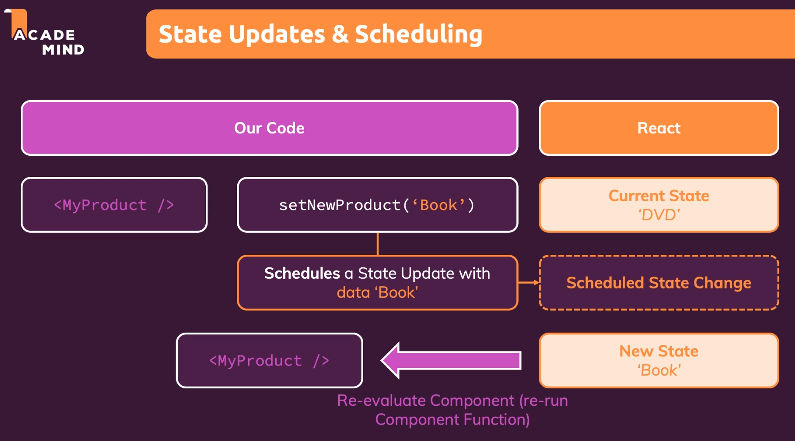

# [Udemy] Prefect REACT Guide (with Redux, Next.js, TypeScript)

---

## Section 12. A Look Behind The Scenes of React & Optimization Techniques
#### How React Works

12-1 How Does React Work Behind The Scenes?

12-2 Understanding the Virtual DOM & DOM Updates

12-3 Understanding State & State Updates

---

<br>

## <span style='font-weight:700;background:#D3D3D3'>How Does React Work Behind The Scenes? </span>
### How Does React Work?
* <strong>React</strong>
    * A JavaScript library for building user interfaces
* <strong>Components</strong>
    * React 의 핵심 
    * 컴포넌트를 사용하여 UI 구축 및 업데이트 
* <strong>ReactDOM</strong>
    * Interface to the web

<br>

* <strong>React - ReactDOM - RealDOM</strong>
    * React.js 자체는 web 을 알지 못하며, Browser 와 전혀 관계가 없다. React는 컴포넌트 및 상태 객체 관리 등을 하는 라이브러리일 뿐이다 (컴포넌트만 신경쓴다)
    리액트는 변경된 내용과 화면에 표시되어야 할 정보를 현재 사용중인 Interface 에 전달한다. 예를 들어, ReactDOM!
    ReactDOM 은 Browser 의 일부인 RealDOM 에 대한 작업을 하므로, 사용자가 보는 화면에 무언가를 표시하는 역할을 ReactDOM 의 역할이다. 
    * React 는 Props(컴포넌트에 전달하는 데이터), State (컴포넌트 내부 데이터), Context (컴포넌트 전체 데이터) 등을 다룬다. 
    이들이 변경되면 이들을 사용하는 컴포넌트 역시 React 를 통해 변경되고, React 는 이 컴포넌트가 화면에 새로운 것을 표시하는지 확인한다. 화면에 무언가 그리려 한다면, React 는 이를 ReactDOM 에 알린다.
    그러면 ReactDOM 은 새로운 화면, 새로운 컴포넌트, 새로운 출력을 할수 있게끔 한다. 


<br>


* Component 와 RealDOM 의 통신이 어떻게 작동할까?
최종적으로 React 가 하는 일 : virtualDOM 이라는 개념 사용
VirtualDOM : App 이 마지막에 만들어내는 컴포넌트 트리 결정
각각의 하위 트리를 갖고 있는 컴포넌트들을 JSX 코드를 반환하는데, 이 VirtualDOM 은 컴포넌트 트리의 현재 모양과 최종 모양을 정한다.
가령, 상태가 업데이트되면 이 정보는 ReactDOM 으로 전달되어 갱신 전후의 상태 차이를 인식하고 리액트가 컴포넌트 트리를 통해 구성한 가상 스냅샷인 virtualDOM 과 일치하도록 realDOM 을 조작하는 방법을 알 수 있게 한다. 

<br>

### Re-Evaluating Components !== Re-Rendering the DOM
위의 과정 내내 react 가 컴포넌트 함수를 재실행하고 컴포넌트를 재평가한다. 또한 State, props, context, component 에 변경이 발생하면 컴포넌트 함수가 재실행되어 React 가 이를 재평가한다.
하지만 이 '재평가' 가 DOM 을 다시 렌더링하는 것은 아니다
<u>React 에 의해 컴포넌트 함수가 재실행된다고 해서 realDOM 의 각 부분들이 다시 렌더링되거나 재평가되는 것은 아니다.</u>


Component 와 리액트 부분, 그리고 RealDOM 을 구분할 줄 알아야 한다.
* 컴포넌트는 state, props, context 가 변경될 때 재평가된다. 이러면 리액트는 컴포넌트 함수를 다시 실행한다. 
* RealDOM 은 리액트가 구성한 컴포넌트의 이전 상태와 트리, 그리고 현재 상태간의 차이점을 기반으로 변경이 필요할 때만 업데이트 된다.
    즉 RealDOM 은 필요한 경우에만 변경된다. (it changed rarely and only when need it)

이것은 성능 측면에서 매우 중요한데, 이전과 현재의 상태를 가상으로 비교하는 작업은 메모리 안에서만 발생하므로 간편하고 자원도 적게 들기 때문이다.
RealDOM 을 사용하게 된다면, 즉 브라우저에 직접 렌더링하는 것은 성능 측면에서 자원이 많이 필요하게 된다. RealDOM 을 사용하는 작업은 성능 부하가 많이 발생하기 때문
한 곳에서의 작은 변경은 괜찮지만 여러 곳에서 소규모 변경이 발생한다면 RealDOM 을 그만큼 많이 사용하므로 페이지가 느려질 수 있다.

이렇게 React 는 virtualDOM 과의 비교를 통해 최종 스냅샷과 현재의 스냅샷을 RealDOM 에 전달하는 구조를 갖는다. 이것이 리액트가 작동하는 방식이다.
VirtualDOM 을 통해 2개의 스냅샷 간의 차이점을 알아낸다.

<br>

### Virtual DOM Diffing


실제 예시를 확인하기 위해 컴포넌트 Evaluation Result (=Previous Evaluation Result) 를 살펴보자. 
마지막으로 컴포넌트 함수를 실행했던 시점을 'Previous ER' 이고, 여기에서 상태가 변경되어 새로운 문장을 더 보여주어서 'Current ER' 이 되었다.
이 경우, 리액트는 이 두 스냅샷간의 차이점이 ```<p>This is new!</p>``` 임을 확인하고 이를 ReactDOM 에 보고하면 ReactDOM 은 RealDOM 을 업데이트하고 새로운 문장을 집어 넣는다.
ReactDOM 은 전체DOM 을 re-rendering 하지 않는다.
h1 이나 div 요소는 건드리지 않고 div 안의 h1 요소 다음에 p 문장만을 추가한다.
이것이 백그라운드에서 React 가 작동하는 방식이다.

<br>

### Practice
React 는 state, props, context 변경 시에만 함수를 재실행하고 재평가한다.
App.js 는 root componentn로, props 나 context 는 거의 바뀌지 않는다. 
따라서 state 변화를 통해 이를 확인해야 한다.
context 에서도 내부적으로 state 를 사용하므로 context 를 통해 값이 변경될 수 있다.
props 는 부모에서 자식 컴포넌트로 향하는 것이다. 그렇다면 props 를 통해 넘겨받은 값은 언제 바뀔까? 부모의 상태가 다른 상태로 변경되었을 경우에만 바뀐다.

이전 스냅샷에 기반해 작업
```js
const toggleParagraphHandler = () => {
setShowParagraph(prevShowParagraph => !prevShowParagraph)
}
```

```js
import React, { useState } from 'react';

function App() {
  const [showParagraph, setShowParagraph] = useState(false)

  console.log('App Running')

  const toggleParagraphHandler = () => {
    setShowParagraph(prevShowParagraph => !prevShowParagraph)
  }

  return (
    <div className="app">
      <h1>Hi there!</h1>
      {showParagraph && <p>This is new!</p>}
      <Button onClick={toggleParagraphHandler}>Toggle showParagraph</Button>
    </div>
  );
}

export default App;
```

1. 페이지가 로드되면서 React가 App 컴포넌트를 화면에 최초로 표시
첫 렌더링을 하면서 React 는 div, h1 element, Button 이 필요하다는 것을 알게 된다. 이 때 p 는 처음에 표시되지 않게 해놨기 때문에 p 는 없다.
컴포넌트를 처음으로 렌더링한 이후 이전 스냅샷은 존재하지 않는다. 따라서 차이점을 비교하는 과정에서 div 태그, h1 태그, Button 이 다시 렌더링된다. 
이 정보가 ReactDOM 패키지로 전달된다. 따라서 화면에 렌더링 결과가 표시된다.

2. 버튼을 누르면 'App Running' 이 또 찍힌다.
즉, 매 번 state 변경이 발생하면 컴포넌트 전체가 재실행 및 재평가된다.

이것이 RealDOM 에는 어떤 영향을 미칠까?
RealDOM 을 통한 업데이트는 virtual snapshot 간의 차이점만 반영된다.

<br>

```js
// App.js
import React, { useState } from 'react';
...
import DemoOutput from './components/Demo/DemoOutput';

function App() {
  const [showParagraph, setShowParagraph] = useState(false)

  const toggleParagraphHandler = () => {
    setShowParagraph(prevShowParagraph => !prevShowParagraph)
  }

  return (
    <div className="app">
      <h1>Hi there!</h1>
      <DemoOutput show={showParagraph} />
      <Button onClick={toggleParagraphHandler}>Toggle showParagraph</Button>
    </div>
  );
}

export default App;
```
```js
//DemoOutPut.js
const DemoOutput = props => {
    return (
        <p>{props.show ? 'This is new!' : ''}</p>
    )
}

export default DemoOutput
```
버튼을 클릭할 때 마다 App Running 문구가 확인된다. 
실제 변경은 DemoOutPut 에서 발생하지만, 이에 대한 State (=show) 를 관리하는 App 컴포넌트 역시 재실행되기 때문이다. 
즉, state, props, context 의 변경이 다른 컴포넌트에 어느 부분에 시각적으로만 영향을 준다고해서 App 컴포넌트가 재평가되지 않는 것은 아니다. state 관리를 하고 있기 때문이다. 
DemoOutput.js 에 콘솔로그를 추가하면 매 버튼 클릭마다 문구가 출력될 것이다.
매 클릭마다 props 가 변경되기 때문이다.

<br>

App.js 에서 show prop의 값을 고정하면 어떨까?
```<DemoOutput show={false} />```
위와 같이 수정하고 버튼을 클릭하면 App 과 DemoOutput 의 콘솔 모두 출력된다.
props 는 바뀐게없다. props.show=false 로 불변이다.
그렇다면 왜 DemoOutput 이 재실행된것일까?
App 함수는 상태가 변경되었기 때문에 재실행된다.
App 함수에는 반환(return)문이 있고, 이 반환문은 JSX 코드를 반환한다.
여기에 있는 모든 JSX 요소들은 결국 컴포넌트 함수에 대한 호출과 같다.
즉, DemoOutput 컴포넌트에 대한 함수를 호출하고 Button 컴포넌트에 대한 함수를 출력한다. 
이것이 자식 컴포넌트들 역시 재실행되고 재평가되는 이유이다.
부모 컴포넌트들이 변경되었고 자식 컴포넌트는 부모 컴포넌트의 일부분이기 때문이다.
부모 컴포넌트 함수가 재실행되면 마찬가지로 자식 컴포넌트 함수도 재실행된다.
따라서 props 의 값은 여기서는 상관이 없다. 그저 '부모 컴포너트'가 바뀌었을 뿐이다.

<br>

props 의 변경은 RealDOM 의 변경으로 이어질 수는 있지만, 
함수가 재평가 되는 경우에는 부모 컴포넌트가 재평가되는 것으로 충분하다. 
물론 DemoOutput 이 재실행된다고해서 RealDOM 이 변경되는 것은 아니다.
컴포넌트 재평가 또는 재실행이 일어나도 RealDOM 이 다시 렌더링되거나 변경되는 것은 아니다.

<strong>" 자식 컴포넌트 재평가 "
컴포넌트가 재실행되면 이의 모든 자식 컴포넌트들 역시 재실행, 재평가된다. 따라서 DemoOutput 컴포넌트, Button 컴포넌트 모두 재평가된다. </strong>

이렇게 연결된 모든 컴포넌트 함수가 재실행되면 굉장히 많은 함수가 virtual comparison 된다는 것인데, 성능에 영향을 미치지 않을까?
그렇지 않다. 예를 들어 위의 예시에서 DemoOutput 은 변경되지 않았으므로 재평가하지 않았다. 하드코드된 props 만이 바뀌었다.
만약 props 가 없다면 App 컴포넌트의 state 변경이 없으므로 출력 결과 역시 바뀌는 것이 없다. 그런식으로 DemoOutput 과 모든 자식 컴포넌트를 재실행하는 것은 낭비이다.

<br>
이런 작업은 확실히 어느 정도의 성능을 필요로 한다.
이 작업은 가상 비교(virtual comparison)이기 때문에
리액트는 이런 식의 실행 및 비교 작업에 최적화되어 있다.

따라서 다수의 어플리케이션 환경에서는 문제가 되지 않는다.
그러나, 더 큰 어플리케이션이라면 좀 더 최적화가 필요할 것

따라서 특정한 상황일 경우에만 DemoOutput 과 같은 것을 재실행하도록 리액트에 지시할 수 있다.

특정 상황은 컴포넌트가 받은 props가 변경되었다던가하는 경우이다.
```<DemoOutput show={false} />``` 에서 show 의 값이 바뀔 경우에만 DemoOutput 을 재실행하는 것이다.
어떻게 리액트에게 이런 식으로 행동하라고 할 수 있을까?
props가 바뀌었는지 확인할 컴포넌트(예: DemoOutput)를 지정한 뒤에 wrap 해주면 끝.

<strong>React.memo</strong>
```export default React.memo(DemoOutput)```
* 함수형 컴포넌트에만 가능
* 함수형 컴포넌트를 최적화
* 역할 
  React.memo는 인자로 들어간 컴포넌트에 어떤 props가 입력되는지 확인하고 입력되는 모든 props의 신규 값을 확인한 뒤 이를 기존의 props의 값과 비교하도록 리액트에게 전달.
  그리고 props의 값이 바뀐 경우에만 컴포넌트를 재실행 및 재평가
  그리고 부모 컴포넌트가 변경되었지만 그 컴포넌트의 props 값이 바뀌지 않았다면 컴포넌트 실행은 건너뛴다


최초에는, App이 처음으로 렌더링되기 때문에 DemoOutput은 바로 실행된다
하지만 이후에는 버튼을 누르면 APP RUNNING과 Button RUNNING만 확인되고 DemoOutput RUNNING은 출력되지 않는다.

이렇게, 불필요한 재렌더링을 피하기 위해서 최적화가 이루어진다.

이렇게 최적화가 가능하다면 왜 이걸 모든 컴포넌트에 적용하지 않는 걸까?
<strong>최적화에는 비용이 따르기 때문</strong>

이 memo 메소드는 App에 변경이 발생할 때마다 인자로 전달된 컴포넌트로 이동하여 기존 props 값과 새로운 값을 비교한다
그러면 리액트가 두 가지 작업을 할 수 있어야 한다. 기존 props 값을 저장할 공간과 비교하는 작업이 필요하다. 이 각각의 작업은 개별적인 성능 비용이 필요하다.
따라서, 이 성능 효율은 어떤 컴포넌트를 최적화하느냐에 따라 달라지게 된다
컴포넌트를 재평가하는 데에 필요한 성능 비용과 props를 비교하는 성능 비용을 서로 맞바꾸는 것.
이는 props의 개수와 컴포넌트의 복잡도, 자식 컴포넌트의 숫자에 따라 달라지므로 어느 쪽의 비용이 더 높다고 말하는 것은 불가능하다.

자식 컴포넌트가 많아서 컴포넌트 트리가 매우 크다면 React.memo는 매우 유용하다.
그리고 컴포넌트 트리의 상위에 위치해있다면 전체 컴포넌트 트리에 대한 쓸데없는 재렌더링을 막을 수 있다.

이와는 반대로
부모 컴포넌트를 매 번 재평가할 때마다 컴포넌트의 변화가 있거나 props의 값이 변화할 수 있는 경우라면 React.memo는 크게 의미를 갖지 못한다.
왜냐하면 컴포넌트의 재렌더링이 어떻게든 필요하기 때문이다.
이럴 때는 props 값의 추가적인 비교에 대한 비용을 아낄 수 있겠지만 오버헤드로 발생하는 코스트는 아낄 만한 가치가 없다.

그리고, 앱 크기에 따라서도 달라진다.
매우 작은 앱, 매우 작은 컴포넌트 트리의 경우에는 이런 과정을 추가하는 것이 필요가 없다.
하지만 불필요한 재평가를 잘라내버릴 수 있는 큰 규모의 앱이라면 그럴 만한 가치가 있다.

모든 컴포넌트를 React.memo로 래핑할 필요는 없다. 
그 대신, 컴포넌트 트리에서 잘라낼 수 있는 몇 가지의 주요 컴포넌트 부분을 선택해서 사용하면 된다. => 모든 자식 컴포넌트에 대한 작업보다 훨씬 효과적이다.

버튼은 트리거 컴포넌트이기 때문에 React.memo 를 적용하는 것이 좋은 것인지, 아니면 나쁜 것인지를 논해보자.
이 버튼이 다시 변경될 일이 없다는 걸 알고 있으므로 버튼에 대해 매번 재평가하는 것은 가치가 없다 아무것도 바뀔 일이 없기때문이다.
Button 을 React.memo를 이용해 래핑한다.
App을 새로고침하면 Button RUNNING이 표시된다
버튼을 클릭할때마다 Button RUNNING이 표시된다
왜 이런 일이 발생하는 걸까?
Button RUNNING이 계속 표시된다는 것은 props의 값이 계속 바뀐다는 뜻이다. 버튼을 확인해보면 안에는 onClick이라는 props 하나밖에 없다. 이 값은 불변이다. 텍스트도 같고 실행되는 함수도 항상 같다.
```<Button onClick={toggleParagraphHandler}>Toggle showParagraph</Button>```

이 것은 리액트에서 흔하게 발생하는 오류 중 하나이다. 
이 App 컴포넌트는 함수이기 때문에 마치 일반적인 자바스크립트 함수처럼 재실행된다.
왜냐하면, 결국 이 것은 상태가 바뀌게 되면 일반적인 자바 함수와 같기 때문이다.
여기서 조금 다른 것은 이 함수는 사용자가 아닌 리액트에 의해 호출된다는 것이다.
그렇지만 여전히 일반 함수처럼 실행되는데 이 말은 모든 코드가 다시 실행된다는 의미이다.

물론 버튼에 전달되는 onClick 함수는 매번 재생성된다.
이는 App 함수의 모든 렌더링, 또는 모든 실행 사이클에서 완전히 새로운 함수입니다, 재사용하지 않는다.
이 것은 우리가 매번 다시 만드는 상수이기 때문이다.
App 컴포넌트 내의 모든 코드가 다시 실행되므로 당연히, 새로운 함수가 만들어진다.
이 함수는 이전과 같은 함수가 아니고 같은 기능을 하는 새로운 함수이다.
자바스크립트에서는, App 함수가 실행될 때마다 만들어지는 함수는 모두 새로운 함수이다.

그런데 이는 DemoOutput에 잘못된 정보가 갔을 때도 해당된다.
```<DemoOutput show={false} />``` 앞서 이 값들(false)은 절대 변하지 않는다고 했다.
사실 기술적으로는 맞지 않다. App 함수는 재실행된다고 했으니 매번 이 false 값이 새로 만들어지는 것이다.
마지막 렌더링 사이클에서 false가 발생했더라도 재실행하면 새로운 false가 생성되는 것이다.

```<Button onClick={toggleParagraphHandler}>Toggle showParagraph</Button>```
그렇다면, React.memo가 DemoOutput에서는 작동하는데 왜 Button에서는 작동하지 않는 걸까요?
false와 toggleParagraphHandler 함수는 뭐가 다른 걸까요?
새로운 false가 생성되고 새 함수가 만들어졌다면 이 두 컴포넌트(DemoOutput, Button)는 재평가해야 하는 걸까요?
false는 boolean 이고 문자열, 또는 숫자와 같은 이러한 boolean 값은 자바 스크립트의 원시 값이다.
이 React.memo가 최종적으로 하는 일은 props의 값을 확인하고 props.show를 직전의 값인 props.previous.show와 비교한다. 
(실제로 내부적으로 아래와 같이 쓰이는 것은 아님. 이런식이라고 생각하면됨)
```props.show === props.previous.show```
props.show 의 이전 값을 확인하고 현재의 값과 비교하는데, 이 작업은 일반 비교 연산자를 통해 합니다
원시값이라면 이런 비교가 가능하다.
```false===false```  ```'hi'==='hi''```
그러나 배열이나 객체, 함수를 비교한다면 달라진다. 
```[1,2,3]===[1,2,3]``` 이 두 배열을 비교한다고 하면 사람의 눈에는 같아보이지만 자바스크립트에서는 이 둘은 같지 않다. 자바스크립트에서 함수는 하나의 객체에 불과하다. 

App 함수가 실행될 때마다 새로운 함수 객체가 생성이 되고 이 함수 객체가 onClick props에 전달된다.
이렇게 되면, 버튼은 props.onClick과 props.previous.onClick을 비교하는 셈이 된다.
그리고 이 두 함수 객체는 같은 내용을 갖고 있다 해도 자바스크립트에서 이 둘을 비교하면 결코 동일하지 않다.
따라서, React.memo는 자바스크립트의 이러한 작동방식 때문에 값이 변경되었다고 인식하게 된다.
```setShowParagraph(prevShowParagraph => !prevShowParagraph)```

<br>

### useCallback() 으로 함수 재생성 방지
React.memo는 props를 통한 객체나 배열 또는 함수를 가져오는 컴포넌트에는 사용할 수 없는 걸까?
React.memo는 객체 외에 prop 값에도 작동하게끔 할 수 있다.
객체를 생성하고 저장하는 방식만 조금 변경하면 된다.
이 작업은, 리액트에서 제공하는 useCallback 훅을 통해 할 수 있다.
useCallback 훅은 기본적으로 컴포넌트 실행 전반에 걸쳐 함수를 저장할 수 있게 하는 훅이다.
```js
const toggleParagraphHandler = () => {
  setShowParagraph(prevShowParagraph => !prevShowParagraph)
}
```
이 함수(toggleParagraphHandler)를 리액트에 저장하고, 매번 실행때마다 이 함수를 재생성할 필요가 없다는걸  리액트에 알릴 수 있다.
이렇게 되면, 동일한 함수 객체가 메모리의 동일한 위치에 저장되므로 이를 통해 비교 작업을 할 수 있다.
예를 들어, 객체 1과 객체 2가 있을 때, 이 둘은 비슷해보일지 모르지만 자바스크립트에서 이 둘은 같은 것이 아니다.
```js 
let obj1 = {}
let obj2 = {}
obj1 === obj2 // false
```
하지만, 객체 2가 객체 1과 같은 메모리 안의 같은 위치를 가리키고 있다면 이 두 객체는 같은 객체로 간주한다.
```js 
let obj1 = {}
let obj2 = obj1
obj1 === obj2 // true
```
이 것이 useCallback이 하는 일로 우리가 선택한 함수를 리액트의 내부 저장 공간에 저장해서 함수 객체가 실행될 때마다 이를 재사용할 수 있게 된다. 

사용법 : 저장하려는 함수를 래핑한다
```js
const toggleParagraphHandler = () => {
  setShowParagraph(prevShowParagraph => !prevShowParagraph)
}

const toggleParagraphHandler = useCallback(() => {
  setShowParagraph(prevShowParagraph => !prevShowParagraph)
}, [])
```
여기에 useCallback 훅을 사용하고 함수를 첫 번째 인자로 전달하면 useCallback은 이 저장된 함수를 반환해준다.
그리고, App 함수가 다시 실행되면 useCallback이 리액트가 저장한 함수를 찾아서 그 같은 함수 객체를 재사용한다.
따라서, 어떤 함수가 절대 변경되어서는 안된다면 이 useCallback을 사용해 함수를 저장하면 된다.
두 번째 인자는 useCallback 호출에 대한 의존성 배열이다. 이 의존성은 useEffect 에의 의존성과 같은 것을 의미한다. useCallback 함수를 감싼 컴포넌트로부터 전달받는 모든 것을 사용할 수 있다. 즉, state 나 props, context 를 지정할 수 있다. 
여기에서는 업데이트 함수의 상태만을 명기하면 된다.  
```js
const toggleParagraphHandler = useCallback(() => {
  setShowParagraph(prevShowParagraph => !prevShowParagraph)
}, [toggleParagraphHandler])
```
예시에서 위와 같이 ```toggleParagraphHandler``` state update 함수를 의존성으로 추가하지 않은 이유는 리액트가 useCallback 을 통해 해당 업데이트 함수는 절대 바뀌지 않으며 이전과 동일한 함수 객체임을 보장하기 때문이다.

<br>

```js
const toggleParagraphHandler = useCallback(() => {
  setShowParagraph(prevShowParagraph => !prevShowParagraph)
}, [])
```
위 예시에 내용이 없는 의존성 배열이 있다. 이 빈 배열은 리액트에  toggleParagraphHandler에 저장하려고 하는 이 콜백 함수는 절대 변경되지 않을 것이라고 리액트에 알려주는 배열이다. 따라서 App 컴포넌트가 다시 렌더링되어도 항상 같은 함수 객체가 사용되게끔 한다.

<br>

```js
// App.js
function App() {
  const [showParagraph, setShowParagraph] = useState(false)

  console.log('App Running')

  const toggleParagraphHandler = useCallback(() => {
    setShowParagraph(prevShowParagraph => !prevShowParagraph)
  }, [])

  return (
    <div className="app">
      <h1>Hi there!</h1>
      <DemoOutput show={showParagraph} />
      <Button onClick={toggleParagraphHandler}>Toggle showParagraph</Button>
    </div>
  );
}

export default App;
```
```js
// Button.js
const Button = (props) => {
  console.log('Button Running')
  return (
    <button
      type={props.type || 'button'}
      className={`${classes.button} ${props.className}`}
      onClick={props.onClick}
      disabled={props.disabled}
    >
      {props.children}
    </button>
  );
};

export default React.memo(Button);
```
위의 상태에서 이제 앱을 처음 실행하면 Button RUNNING 문구는 처음 한 번 보이고, 그 뒤로 버튼을 클릭해도 다시 나타나지 않는다.
우리가 전달한 모든 props 값이 비교가 가능하게끔 전달했기 때문에 React.memo가 역할을 수행할 수 있기 때문이다. ```<Button onClick={toggleParagraphHandler}>Toggle showParagraph</Button>``` Button 컴포넌트에 전달된  toggleParagraphHandler 객체가 useCallback 덕분에 메모리 안에서 항상 같은 객체임을 보증하기 때문이다.

<br>

### useCallback() 및 해당 종속성
useCallback을 사용하면, 함수를 저장하고 이를 재사용할 수 있다.
이제 useCallback 의 의존성 배열을 지정해야 해보자.
내 함수는 모든 재렌더링 주기마다 항상 똑같은 로직을 쓰는데, 이게 왜 필요할까?
자바스크립트에서 함수는 클로저(Clousre)이다.
즉, 이 환경에서 사용할 수 있는 값에 클로저를 만든다. (they close over the values that are available in their environment)
(리액트의 작동방식을 이해하려면 이 클로저가 무엇인지를 알아야 함!)
```js
function App() {
  const [showParagraph, setShowParagraph] = useState(false)
  const [allowToggle, setAllowToggle] = useState(false)

  console.log('App Running')

  const toggleParagraphHandler = useCallback(() => {
    if (allowToggle) {
      setShowParagraph(prevShowParagraph => !prevShowParagraph)
    }
  }, [])

  const allowToggleHandler = () => {
    setAllowToggle(true)
  }

  return (
    <div className="app">
      <h1>Hi there!</h1>
      <DemoOutput show={showParagraph} />
      <Button onClick={setAllowToggle}>Allow Toggling</Button>
      <Button onClick={toggleParagraphHandler}>Toggle showParagraph</Button>
    </div>
  );
}

export default App;
```
예를 들어, 예시에 두 번째 버튼이 있다고 해보자. 이를 위해선 새로운 state가 필요하다.
state 와 state update 함수를 만든다. 새 버튼에서 setAllowToggle을 호출하고 값을 true로 고정한다. 
새로운 Button에 allowToggleHandler 함수를 바인딩하고, 다른 함수(toggleParagraphHandler)에서 allowToglle의 상태 스냅샷을 이용해 setShowParagraph를 사용할 수 있는지 확인한다. allowToggle이 true인지 확인하고 true일 경우에만 setShowParagraph를 호출한다. 이렇게 되면 showParagraph의 상태는 토글이 허용되는 경우에만 업데이트된다.

이렇게 하면, App이 새로고침이 된 뒤 [Toggle Paragraph!] 버튼을 누르면 아무 것도 발생하지 않는다. [Allow Toggling] 버튼 을 누르면 [Toggle Paragraph!] 버튼을 눌렀을 때 작동해야 한다.
처음 실행 후 [Toggle...] 버튼을 누르면 아무런 반응이 없다 (정상)
[Allow...] 버튼 누른 후 [Toggle...] 버튼을 누르면 콘솔 로그에 APP RUNNING이 확인되지만, 아무런 동작도 하지 않는다.

왜냐하면 자바스크립트에서 함수는 클로저이고 userCallback을 제대로 사용하지 않았기 때문이다. 함수가 정의가 되면(이 예시에서는 App 컴포넌트 함수) 이 함수가 정의될 때 자바스크립트는 함수 외부에서 정의되었지만 함수 내부에서 사용되는 모든 변수를 잠근다. 
이 예시에서는 allowToggle이 이에 해당하는데 이 것은 App 함수로부터 온 변수 또는  상수이고, 이를 toggleParagraphHandler 함수 안에서 사용한다.
따라서, 자바스크립트는 이 상수에 클로저를 만들고(JavaScript closes over that constant)("A closure is something that closes over open bindings.") 함수를 정의할 때 사용하기 위해 상수를 저장합니다 
이렇게 되면, 다음에 toggleParagraphHandler가 실행이 되면 전에 저장한 상수(allowToggle)를 그대로 사용한다.
따라서, 이 변수의 값은 변수가 저장된 시점의 값을 사용하게 된다.
일반적으로는 괜찮다. 왜냐하면 함수 밖의 변수를 함수 안에서 쓸 수 있으며, 원하는 시점에 함수를 호출할 수 있기 때문이다. (위 예시의 버튼에 바인딩한 함수와 같이)
문제는, useCallback을 사용하여 리액트에게 함수를 저장하라고 지시하면 해당 함수는 메모리 어딘가에 저장된다. 이제 toggle State 의 변경에 의해 App 함수가 재평가 및 재실행되면 리액트는 해당 함수를 재생성하지 않는다. 왜냐하면 앞서 useCallback 을 통해 리액트에게 모든 경우에 함수 재생성을 하지 않게끔 막았기 때문이다.
따라서, 리액트가 해당 함수에 사용하기 위해 저장한 allowToggle의 값은 최신 값이 아니라, App 컴포넌트가 처음 실행된 시점의 값을 저장하고 있다. 자바스크립트는 함수 생성 시점의 allowToggle 상수 값을 저장하고 있기 때문이다.

이로부터 문제가 발생하게 된다. 
이 함수에서 사용하는, 함수 외부에서 오는 값이 변경되었을 수 있기 때문에 함수 재생성을 필요로 하는 때가 있기 때문이다. 지금의 사례가 그 경우이다.
```js
// 기존
const toggleParagraphHandler = useCallback(() => {
  if (allowToggle) {
    setShowParagraph(prevShowParagraph => !prevShowParagraph)
  }
}, [])

// 변경
const toggleParagraphHandler = useCallback(() => {
  if (allowToggle) {
    setShowParagraph(prevShowParagraph => !prevShowParagraph)
  }
}, [allowToggle])
```
따라서 toggleParapraphHandler 함수를 감싼 useCallback 의 두 번째 인자인 의존성 배열에 allowToggle을 종속 형태로 추가함으로써, 리액트에게 이 함수를 저장하라고 할 뿐만 아니라 allowToggle의 값이 바뀌고 새로운 값이 들어오면, 해당 함수를 재생성하고 새로 만든 함수를 저장하라고 지시한다.
이렇게 하면 해당 함수에 항상 allowToggle의 최신 값만을 사용할 수 있다.
allowToggle이 변경되지 않는다면 그럴 땐 함수 재생성을 하지 않는다.

이제, [Toggle Paragraph!] 버튼을 누르면 처음에는 아무 반응이 없고, (정상)
[Allow Toggleing] 버튼을 누르고 [Toggle Paragraph!] 버튼을 다시 누르면 원했던 결과가 출력된다. 
[Toggle Paragraph!] 버튼을 눌렀을 때 Button RUNNING이 한 번만 출력되는 것도 눈여겨봐야한다. 이유는 allowToggleHandler에는 useCallback을 사용하지 않았으므로  React.memo가 이 두 번째 버튼에서는 작동하지 않기 때문이다.
[Toggle Paragraph!] 버튼이 다시 렌더링된다면 두 번 표시되겠지만 useCallback이 이 함수가 매 번 다시 빌드되는 것을 막기 때문에 allowToggle이 변경될 때 한 번만 이 문구를 볼 수 있다.

하지만 클로저가 어떻게 작동하는지를 이해하고 원시값와 참조값에 대한 이해가 뒷받침되면 리액트의 작동 원리를 완벽하게 이해할 수 있게 된다.

<br>

### Summary
리액트 앱에서는 컴포넌트를 통해 작업을 수행한다. 특시 최신 리액트에서는 주로 함수 컴포넌트와 함께 한다. 컴포넌트는 결국 하나의 작업을 수행하고 JSX 코드를 반환한다. 이 JSX 코드는 리액트에게 컴포넌트의 출력이 무엇인지를 알려준다.
리액트 컴포넌트에 state, props, context 등을 사용할 수 있다.(props와 context는 결국 state의 변경으로 이어진다) 이들을 통해 컴포넌트를 변경하거나 컴포넌트 또는 어플리케이션 일부에 영향을 미치는 데이터를 변경하고자 한다.

컴포넌트에서 state를 변경할 때마다 변경된 state가 있는 컴포넌트는 재평가된다. 즉, 컴포넌트 함수가 재실행된다. 따라서 모든 코드가 재실행되고 이렇게 되면 새로운 출력값(return 된 JSX 코드)을 얻을 수 있다.
리액트는 단순히 가장 최신의 평가(evaluation) 결과를 가져와서 직전 평가 결과와 비교한다. 이를 변경에 영향받은 모든 컴포넌트에 대해 실행한다. 그리고 확인된 모든 변경 사항이나 차이점을 ReactDOM에 전달한다. 왜냐하면 ReactDOM을 통해 index.js 파일을 렌더링하기 때문이다. ReactDOM은 전달받은 변경사항들만 브라우저의 RealDOM에 적용한다(변경되지 않은 것들은X)
```js
// index.js
import React from 'react'
import ReactDOM from 'react-dom'
import App from './App'

ReactDOM.render(<App />, document.getElementById('root'))
```

<br>
리액트가 컴포넌트를 재평가할 때 단순히 컴포넌트 재평가만 하는 것이 아니라, 컴포넌트 함수 전체를 재실행하고 이를 통해 코드를 전부 리빌드함으로써 컴포넌트 함수가 반환(return)하는 JSX 코드가 최신 스냅샷의 출력 결과를 리빌드한다. 그리고 그 JSX 코드에 있는 모든 컴포넌트 또한 재실행한다 (연쇄적!) 
이 예시에서는 DemoOutput과 Button 컴포넌트를 재실행한다.
```js
// App.js 
...
return (
    <div className="app">
      <h1>Hi there!</h1>
      <DemoOutput show={showParagraph} />
      <Button onClick={setAllowToggle}>Allow Toggling</Button>
      <Button onClick={toggleParagraphHandler}>Toggle showParagraph</Button>
    </div>
  );
```
하위 컴포넌트의 불필요한 재실행을 막기 위해 React.memo를 통해 리액트에게 props가 실제로 변경되었을 경우에만, 새로운 값이 들어왔을 경우에만 컴포넌트 함수(이 경우, DemoOutput 과 Button)를 재실행하고 새 값이 없다면 함수를 재실행하지 않도록 할 수 있다.
컴포넌트의 재평가는 컴포넌트 함수 전체의 재실행을 의미하는데, 함수에 있는 모든 것들이 다시 실행된다는 사실을 알지 못한다면 이상한 결과를 초래할 수 있다.
```js
function App() {
  const [allowToggle, setAllowToggle] = useState(false)

  const allowToggleHandler = () => {
    setAllowToggle(true)
  }

  return (
    <div className="app">
      <Button onClick={setAllowToggle}>Allow Toggling</Button>
    </div>
  );
}
```
예를 들어, 예시와 같이 함수(App) 안에 함수(allowToggleHandler)를 만들고 이 함수를 props를 통해 컴포넌트(Button)에 전달하면 새로운 함수 객체(function object)를 얻을 수 있는데, 이렇게 되면 React.memo를 통한 도움을 얻을 수 없다. 객체는 참조값이고 React.memo가 내부적으로 실행하는 등호를 통한 비교는 원시값에 대해서는 통용되지 않기 때문이다.
이런 경우에는 useCallback을 사용한다. useCallback을 통해 리액트에게 이 함수를 저장하고, 이를 둘러싼 함수가 재실행되어도 특정 의존성이 변경되는 것이 아니면 함수 재생성을 막을 수가 있다.
```js
const toggleParagraphHandler = useCallback(() => {
  if (allowToggle) {
    setShowParagraph(prevShowParagraph => !prevShowParagraph)
  }
}, [allowToggle])
```

<br>
### Components & State
#### React 의 컴포넌트와 상태 관리법 

또다른 문제가 있다. state 변경으로 인해 App 함수가 재실행된다면 useState 역시 계속적으로 실행된다는 것인데 이 것은 state 값의 초기화를 의미하는 건 아닐까? 지금까지 왜 이 문제는 없었을까?
리액트에서 state 가장 중요한 개념이다. state는 컴포넌트를 다시 렌더링하고 화면에 표시되는 것들을 바꾼다. 따라서, 컴포넌트와 State 와의 상호작용은 리액트의 핵심적인 개념이다. 이 둘 모두 리액트가 관리한다는 것에 주목해야 한다. <strong>리액트는 상태를 관리하고 컴포넌트와의 연결을 관리한다</strong> (React library 를 통해)
예를 들어 useState Hook 를 사용해 컴포넌트와 state간의 상호 작용을 처리한다.
가장 일반적인 형태의 상태 관리(managing state)는 useState Hook를 사용하는 것이다. 이를 사용하여 새로운 state를 만들어서 자동적으로 useState를 호출한 컴포넌트에 이를 연결할 수 있기 때문이다. 이런 종류의 연결도 리액트가 담당한다. useState를 호출하게 되면 리액트는 백그라운드에서 이를 관리하고 컴포넌트와 이를 묶어줄 새로운 상태 변수를 만든다.

<u>App 함수가 재실행할 때마다 매번 useState를 호출했음에도 불구하고 state 의 값을 잃거나 값이 초기화되지 않는 이유는 무엇일까?</u>
<strong>리액트의 '상태 관리 및 컴포넌트와의 연결 관리' 프로세스에 따라 리액트는 useState 와 여기에 전달된 기본값(default value)에 대해서는 컴포넌트가 처음 렌더링될 때, 즉 App 컴포넌트가 최초 실행될 때 이 때 한 번만 고려되도록 처리한다.</strong>
컴포넌트가 처음 렌더링 될 때(=컴포넌트가 최초 실행될 때) useState가 실행되면 리액트가 관리하는 새로운 상태 변수가 생성된다. 리액트는 이 변수가 어느 컴포넌트에 속하는지를 기억해준다. (이 경우, App component) 그리고 기본값을 사용해서 상태값을 초기화한다.
이후의 App 함수 호출되면, 즉 App 컴포넌트를 재평가하는 과정에서 useState가 호출되면 새로운 state는 생성되지 않는다. 리액트는 이 때 해당 컴포넌트에 대한 state가 이미 존재함을 깨닫고 필요할 경우 이 상태를 업데이트한다.
따라서 <strong>리액트는 상태의 관리와 갱신만을 담당하며, 컴포넌트가 DOM에서 완전히 삭제되거나 하지 않는 이상 상태의 초기화는 하지 않는다.</strong>
위 예시의 App 컴포넌트는 루트 컴포넌트이므로 이런 일은 아예 발생하지 않는다. 하위 컴포넌트의 경우라면 조건에 따라 렌더링될 수 있다.
예를 들어 컴포넌트가 삭제되었다면 그리고 다시 연결되었다면 새로운 상태가 초기화될 수 있다.
하지만 DOM에 컴포넌트가 연결되고 유지되는 동안에는 상태는 최초의 초기화 이후에는 갱신만 된다. useReducer의 경우에도 마찬가지이다.

<br>
### State Updates & Scheduling
#### State 스케줄링 및 일괄처리
위에서 리액트가 어떻게 상태를 관리하는지 알았다. 이제 상태에 대한 갱신을 어떻게 하는지 알아보자.

컴포넌트가 있고 컴포넌트 안에서 useState Hook를 통해 (React 가) 일부 상태들을 관리한다. 이 MyProduct 컴포넌트의 초기 state가 DVD라고 해보자. SetNewProduct (useState를 통해 값을 반환하는 상태 갱신 함수) 를 이용해 이 제품의 state 값을 'DVD'에서 'Book'으로 변경한다. 이 때, SetNewProduct가 실행이 완료되었지만 DVD가 바로 변경되지는 않는다.
SetNewProduct가 실행이 끝났지만 DVD가 즉각적으로 바뀌지 않는것이다.
대신에, SetNewProduct를 호출하면, 즉 상태 업데이트 함수를 호출하면 'Book' data로 상태 업데이트를 하게끔 예약(schedule)한다.
이 것이 상태 갱신 예약이다.
리액트는 '예약된 상태 업데이트'를 인지하고 있고, 처리할 계획을 준비하지만 이를 즉시 처리하지는 않는다. 대부분의 경우에는 상태 변경이 발생하면 상태 갱신에 대한 스케줄 작업은 매우 빠르게, 거의 즉각적으로 처리된다. 하지만 리액트는 이 상태 변화를 지연시킨다.
예를 들어보면 대다수의 성능 기반의 작업들이 거의 동시에 진행되는데 잠재적으로 리액트는 더 높은 우선순위를 갖는 것으로 간주한다.
예를 들어, 화면에 사용자가 입력할 수 있는 input field 가 있을 경우, 사용자 입력에 응답하는 것이 화면의 문자를 변경하는 것보다는 더 우선순위가 높다. 이러한 이유로 리액트는 예정된 상태 변경을 연기할 수 있다.

리액트는 상태 변화가 발생하게 되면 이 상태 변화의 순서를 명확히 해서, 같은 type 의 state 임을 보증한다. (it guarantess you that the order of state changes for one in the same type of state is guaranteed)
그래서 SetNewProduct를 다시 호출하여 'Carpet' 으로 변경해보면 이번 상태 변경은 이전의 상태 변경 전까지는 처리되지 않는다. 즉, 순서가 유지되지만 즉각 실행이 항상 되지는 않는 것이다.
결국 언젠가는 이러한 상태 변화가 처리가 되고 state 는 'Book' 으로 바뀔 것이다. 그리고 새로운 상태가 활성화되면, 즉 상태 변화가 처리되면, 리액트는 컴포넌트를 재평가하고 컴포넌트 함수를 재실행할것이다.


스케줄링때문에 동시에 다수의 상태 변화가 예약되있을 수 있다. 따라서 상태를 갱신할 때는 아래 예시와 같은 함수 형태를 이용해서 갱신하는 것이 좋다. 특히 이전 state 의 snapshot 에 의존해야 하는 경우, 이렇게 해야 가장 최신 state 를 얻을 수 있다.
```js
setShowParagraph(prevShowParagraph => !prevShowParagraph)
```
보통 이 작업은 굉장히 빠르게 처리가 되기 문제가 되지 않지만, 이론상 스케줄링 작업은 지연될 수 있으므로 위 방법이 상태 변경이 순서대로 처리되고 이전 상태를 기반으로 매 회 상태 변경이 발생할 때마다 가장 최신의 상태를 얻을 수 있게 해주는 안전한 방법이다.
함수 형태를 사용해야 리액트가 모든 각각의 미완료된(outstanding) 상태 변경 처리를 할 때 가장 최신의 state를 사용하고, 컴포넌트가 재 렌더링되었을 그 시점의 state를 사용하지 않는다.
컴포넌트가 재 렌더링되었을 때의 시점과 상태 변경이 예약되는 시점의 차이가 매우 중요하다
하나의 컴포넌트가 재평가되면서 미완료된 상태 변경 작업이 여러 개 있기 때문이다.
```js
 useEffect(() => {
  const identifier = setTimeout(() => {
    setFormIsValid(emailIsValid && passwordIsValid)
  }, 500)

  return () => {
    clearTimeout(identifier)
  }
}, [emailIsValid, passwordIsValid])
```
이전 프로젝트를 작업할 때 useEffect 내부에서, 이메일과 비밀번호의 유효 상태를 통해 폼의 유효성을 업데이트하는게 안전하다고 했었다. 이전 상태의 스냅샷을 기반으로 상태를 갱신하기 위해 함수 형식을 사용하는 것과 비슷하게 useEffect는 상태 또는 종속된 값이 변경될 때마다 의존성 메커니즘을 통해 내부에서 선언한 코드(effect)가 재실행되게끔 한다.
따라서 컴포넌트 함수가 재실행될때마다 매번 useEffect 내부의 코드(effect)또한 재실행되기 때문에 미완료된 상태 변경 작업이 빠짐없이 모두 실행된다.
useEffect 내부 코드(effect)가 항상 재실행되므로, useEffect 의 두 번째 의존성배열에서 가장 최신의 값을 받아올 수 있다.

이 것들은 같은 문제를 처리하는 서로 다른 두 가지의 방법인데 목적에 따라 선택해서 사용하면 된다.
```js
// 1. 이전 스냅샷에 의존하는 상태 갱신
const toggleParagraphHandler = useCallback(() => {
  if (allowToggle) {
    setShowParagraph(prevShowParagraph => !prevShowParagraph)
  }
}, [allowToggle])

const allowToggleHandler = () => {
  setAllowToggle(true)
}

// 2. 다른 상태에 의존하는 특성 상태 갱신
useEffect(() => {
  const identifier = setTimeout(() => {
    setFormIsValid(emailIsValid && passwordIsValid)
  }, 500)

  return () => {
    clearTimeout(identifier)
  }
}, [emailIsValid, passwordIsValid])
```

1) 동일 상태의 이전 스냅샷에 의존하는 상태를 갱신하고자 한다
2) 다른 상태에 의존하는 특정 상태를 갱신하고자 한다

상태 갱신 스케줄링(state updates scheduling)은 꼭 기억하셔야 할 메커니즘이다.
스케줄 업데이트 관리는 리액트가 해주므로 이를 이용해 무언가 하고자 함이 아니라, 발생할 수 있는 잠재적인 위험을 배제하기 위함이다.

```js
export const NavContextProvider = (props) => {
  const [draswerIsOpen, setDrawerIsOpen] = useState(false)
  const [currentNavPath, setCurrentNavPath] = useState('burger-builder')

  const navigateHandler = (navPath) => {
    setCurrentNavPath(navPath)
    // state 'currentNavPath' is NOT updated here
    setDrawerIsOpen(false)
  }

  const openSideDrawerHandler = () => {
    setDraswerIsOpen(true)
  }
}
```
NavContext 컴포넌트의 예시를 보자.
navigateHandler 에서 두 개의 상태 업데이트 함수를 호출했다. 이렇게 함수를 호출한다고 각각의 상태갱신 함수 바로 다음 행에서 상태가 갱신되는 것은 아니다. 
currentNavPath state는 주석이 쓰인 위치에서 갱신되지 않고 갱신 예악만 되며 NavContextProvider 전체 컴포넌트가 재실행된 이후에 사용 가능한 최신 상태가 된다.
navigateHandler 에는 이 뿐만 아니라 다른 상태 갱신 함수도 있다. 즉 두 개의 상태 갱신이 스케줄링된다. 하지만 컴포넌트의 재실행 및 재평가 또한 마찬가지로 두 번 이루어질까? 
그렇다고 예상하겠지만 리액트는 여기에서 그렇게 처리하지 않는다.

이렇게 두 개의 state update 가 동일한 시간대의 코드 조각 내에, 서로 다른 promise 에 있지 않고, 둘 사이에 시간 지연이 없이 서로의 앞 뒤에 존재한다면, 즉 두 개의 동기 함수가 서로 차례로 존재한다면, 어디에서 state updating function 을 호출해야 할까?
(If you have two state updates in the same synchronous code snippet after each other, so not in a promise, in different '(promise.)then' blocks, but in the same function, where nothing in between would cause a time delay or anything like that, so if you have two synchronous lines of code after each other, where you would then call a state updating function?)
그러한 경우에 리액트는 이들에 대한 상태 갱신(state updates)을 하나의 긴 동기화 프로세스에서 일괄 처리(batch)할 것 입니다.
예를 들어서, <strong>하나의 함수가 처음부터 끝까지 어떠한 콜백이나 프로미스 없이 실행된다면 리액트는 이 함수로부터 발생하는 모든 상태 갱신 작업을 하나의 상태 갱신 작업으로 일괄처리</strong>합니다.

다시 이 그림으로 돌아와서 보자면, MyProduct 컴포넌트의 newProduct state 뿐 아니라 동일 함수 내의 완전히 다른 state를 업데이트하려고 해도, 두 개의 상태를 변경하는 하나의 상태 변경 작업 스케줄이 존재하게 된다.
단 하나의 프로세스이다. 컴포넌트의 재실행 및 재평가를 동반하는 각각의 2번의 변경 작업이 아니라, 함수 내의 모든 서로 다른 상태 변경 작업이 하나의 작업으로 묶인 하나의 scheduled change 인 것이다.
<strong>상태 배치 작업(state batching)</strong>은 리액트를 통한 작업에서 반드시 알아야 하는 또 다른 개념이다.

<br>
### useMemo() 로 최적화하기
이제 useCallback에 대해 알아보자.
아래 예시의 App 컴포넌트에서 useCallback 이 사용됐다. 단순히 함수를 저장하고 재생성하지 않게끔 하기 위함이다. changeTitleHandler 함수는 Button 컴포넌트에 onClick prop 으로 전달됐다. Button 컴포넌트는 내부적으로 React.memo 를 사용한다. 
changeTitleHandler 함수를 useCallback 에 저장했기 때문에 버튼의 props는 변경되지 않으므로 Button은 이 경우, 절대로 re-render 되지 않는다.
```js
// App.js
function App() {
  const [listTitle, setListTitle] = useState('My List')

  const changeTitleHandler = useCallback(() => {
    setListTitle('New Title')
  }, [])

  return (
    <div className='app'>
      <DemoList title={listTitle} items={[5, 3, 1, 10, 9]} />
      <Button onClick={changeTitleHandler}>Change List Title</Button>
    </div>
  )
}

// Button.js
...
export default React.memo(Button)

// DemoList.js
const DemoList = (props) => {
  const sortedList = props.items.sort((a, b) => a - b)
  
  return (
    <div className={classes.list}>
      <h2>{props.title}</h2>
      <ul>
        {sortedList.map((item) => (
          <li key={item}>{item}</li>
        ))}
      </ul>
    </div>
  )
}
```
그리고 DemoList 에서는 오름차순으로 '정렬된' 리스트를 렌더링한다.
DemoList 에 prop 으로 전달한 데이터는 정렬되지 않은 상태이다. 이는, 리스트에서 어떤 종류의 정렬을 실행한다는 겁니다
자, 여기에서 간단한 내장 정렬 메소드로 목록을 정렬했는데 정렬 방법을 정의하는 함수를 통해 어떻게 리스트를 정렬할지를 전달했습니다
정렬 방법에 대해서 더 자세한 내용이 알고 싶으시면 이에 대한 문서를 확인하실 수 있습니다
이렇게 때로는 코드에 대로는 컴포넌트에 이런 로직이 있어 성능에 민감할 수 있습니다
보시다시피 이렇게 리스트가 짧다면 정렬 역시 빠릅니다만 리스트가 길다면, 아니면 다른 작업을 하는 중이라면 분명 시간 소요가 더 긴 코드가 있을 수 있습니다
물론 이런 코드 역시 실행되어야 하지만 전체 컴포넌트가 재평가될 때마다 이런 코드를 실행하고 싶지는 않잖아요?
물론, 우리는 다른 강의에서 불필요한 재평가 과정을 피하는 방법을 알아봤습니다
React.memo가 있죠?
이걸로 DemoList를 래핑하면 됩니다
이렇게 하면 불필요한 동작을 막을 수 있죠
이제 콘솔 로그로 DemoList RUNNING을 추가하면 당연히 초기 화면에서는 이를 확인할 수 있습니다
즉 리스트가 정렬되었다는 뜻이죠
하지만 그 뒤에는 실행되지 말아야 합니다
여기 보시면 버튼이 있죠?
이를 클릭하면 페이지의 제목이 바뀝니다
이 제목은 제 리스트의 일부분입니다
따라서 버튼을 클릭하면 DemoList가 재실행됩니다
props의 일부가 바뀌었기 때문에 제목이 바뀌었으니 당연히 재실행이 되어야 하죠
제목은 실제 값이므로 React.memo는 정상 작동합니다
이 경우에는 재실행을 수행하죠
물론 현재는 부모 컴포넌트가 재 렌더링되었으니 항상 다시 실행이 됩니다
여기 이 배열이 부모 컴포넌트가 실행될 때마다 지속적으로 재생성되기 때문이죠
따라서 제목이 바뀌지 않더라도 상위 구성 요소가 여타 이유로 재실행되면 새로운 배열을 생성하기 때문에 DemoList 컴포넌트는 다시 실행됩니다
함수와 마찬가지로, 배열 역시 객체입니다
그리고 객체는 참조값이죠
따라서 이 두 배열은 같은 원소, 같은 순서를 갖고 있어도 이 둘은 실제로는 절대 같은 배열이 아닙니다
메모리 안에서 다른 위치를 점하고 있으니까요
여기에는 어떠한 문제도 없습니다만 제가 방금 설명했듯이, 제목이 바뀌기 때문에 DemoList를 리빌드해야하는 타당한 이유가 있습니다
이처럼 컴포넌트의 재실행이 재평가되는 경우가 있습니다
하지만, 과거에 했던 모든 작업을 반복하고 싶지 않을 때도 있겠죠
특히 다시 해야 할 작업이 성능에 민감한 작업일 경우 더욱 그렇습니다
그리고, 정렬은 컴포넌트에서 수행 가능한 대표적인 성능 집약적 작업 중 하나입니다
그럼 이에 대한 해결책이 있을까요? 이 해결책은 useCallback을 사용하여 함수 객체를 저장하고 입력값이 변경될 경우에만 리빌드하는 겁니다
다른 종류의 데이터에도 비슷한 것이 있죠
우리가 임포트할 수 있는 다른 훅, 바로 useMemo 훅입니다
useMemo는 기본적으로 저장을 할 수 있는데 useCallback이 함수에 대한 것을 저장하듯
모든 종류의 데이터를 저장할 수 있습니다
자, 이를 저장할 수 있습니다
자, 발음이 비슷한 2개의 용어가 있는데 사실 이 둘은 거의 비슷합니다
자, 먼저 여기에서 useMemo를 호출하여 이 정렬의 결과를 기억하게 할 수 있습니다
그리고 useMemo의 첫 번째 인자에는 함수가 들어가야 합니다
하지만 함수를 기억하게 하는 건 아니고요
이 함수가 여러분이 저장하고 싶은 것을 반환할 것입니다
이 경우에서는 정렬된 배열을 반환할 겁니다
useCallback과 마찬가지로, useMemo도 2개의 인자를 필요로 하는데 그 것은 의존성 배열입니다
이 의존성 배열을 통해 저장된 값에 변경 사항이 생길 때마다 업데이트됩니다
여기에서는, 값이 변경되고 새로운 값이 추가될 때 재정렬을 할 것입니다
따라서 여기에는 item이 들어가야겠죠
props를 추가할 수도 있는데 여기의 item은 props을 통해 나오니까요
즉 전체 props 객체가 여기에서의 의존성 객체라는 겁니다
따라서 이는 항상 재계산됩니다
이보다 좀 더 우아한 방법은, 앞서 확인했던 useEffect와 그 의존성을 사용하는 겁니다
우리는 props에서 무언가를 꺼내기 위해 디스트럭쳐링을 사용할 수 있습니다
여기서는 item을 꺼내기 위해 사용하는 거겠군요
그리고, 이 위치에 item을 의존성으로 추가하고 이를 정렬합니다
이제 item에 변경 사항이 발생할 때만 리빌드를 진행하게 됩니다
무슨 일이 일어나는지 봅시다
확인을 위해 콘솔 로그에 Items sorted를 추가하고 실행을 해보겠습니다
새로고침을 하면, 최초 실행이 되는데 제목을 변경해도 여전히 실행이 됩니다
생각대로 구동되지 않는 군요
왜 이게 다시 실행되었을까요?
item이 바뀌었기 때문입니다
방금 전에 말씀드린 부분이죠?
여기의 item은 App이 재실행될 때마다 새로운 배열을 생성하기 때문에, 재생성됩니다
그러니까 기술적으로는 같은 값을 가지고, 같은 순서로 된 비슷한 배열이지만 메모리상에서는 새로운 배열이기 때문에 내포한 값이 같더라도 기존 배열과 다른 새로운 배열로 취급합니다
이 것이 이 강의에서 앞서 여러 번 언급했던 참조값입니다
따라서, 불필요하게 새로운 배열을 전달하는 것을 막기 위해서 useMemo를 사용하겠습니다
먼저 useMemo를 임포트하고 이 위치에 배열을 반환하는 부분을 함수로 래핑하겠습니다
그리고 빈 의존성 배열을 추가합니다 
이 빈 의존성 배열은 값에 변함이 없습니다
외부 의존성이 없고 하드 코딩되어 있습니다
따라서 useMemo를 사용할 수 있죠
그리고 이 값을 함수 외부로 꺼내오고 useMemo를 호출한 결과를 listItems에 저장합니다
그리고 이를 items에 전달하죠 
이렇게 함으로서 불필요한 재정렬을 막을 수 있습니다
자, 이제 첫 실행에서 items가 정렬되었습니다
그리고 Change list title을 누르면 useMemo 덕분에 더 이상 재정렬되지 않습니다
이 useMemo는 useCallback에 비해 사용 빈도는 낮을 겁니다
함수를 기억하는 것이 훨씬 더 도움이 되고 데이터를 기억할 일보다 빈도수가 더 많을 테니까요
물론 데이터 재계산과 같은 성능 집약적 작업 때문에 데이터를 저장해야 할 필요도 있지만
이런 경우가 아니면 별로 사용하지 않을 것입니다
이를 항상 기억하십시오
useMemo를 사용해 데이터를 저장하면 이는 메모리를 사용하는 것이고 이런 함수 저장 또한 일정 성능을 사용하는 겁니다
따라서 useMemo는 여러분이 사용하는 모든 값마다 사용하는 것이 아닙니다
하지만 지금과 같은 시나리오같이 뭔가를 정렬하는 경우라면 이후의 컴포넌트 업데이트에서 불필요한 정렬을 막을 수 있으므로 이를 사용하시는 것이 좋습니다

어플리케이션이 느려지거나 어느 부분을 개선해야 할 때 이런 식으로 최적화가 가능한 부분을 찾아보는 것입니다