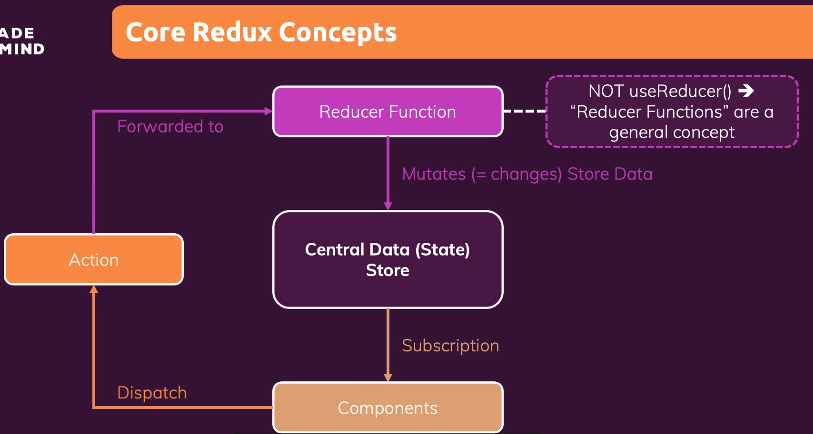
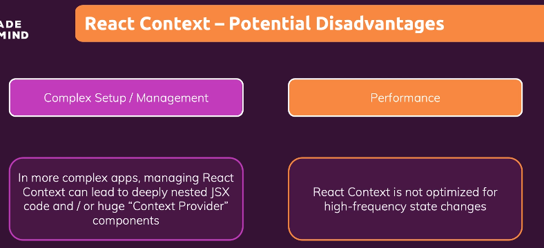

# [Udemy] Prefect REACT Guide (with Redux, Next.js, TypeScript)

---

## Section 18. Understanding Redux
#### Managing App-Wide State with Redux

18-1 What id Redux? And Why?

18-2 Redux Basics & Using Redux with React

18-3 Redux Toolkit

---

<br>

## <span style='font-weight:700;background:#D3D3D3'>What is "Redux"?</span>
* <strong>Redux</strong>
    * third party library, react library
    * <strong>A state management system for cross-component or app-wide state</strong>

<br>

### What Is Cross-Component / App-Wide State?
useState 와 useReducer 과 같은 state managing Hook 을 사용해서 데이터의 변경을 리액트에 알리면 리액트는 UI 를 업데이트한다. 
state 는 세 가지로 구분할 수 있다. 

* Local State 
    * State that belongs to a single component
    * E.g. listning to user input in a input field; toggling a "show more" details field
    * => <u>Should be managed component-internal with useState() / useReducer()</u>
* Cross-Component State
    * State that affects multiple components
    * E.g. open/closed state of a modal overlay
    * => <u>Requires "prop chains" / "prop drilling"</u>
* App-Wide State
    * State that affects the entire app (most/ all components)
    * E.g. user authentication status
    * => <u>Requires "props chains" / "prop drilling"</u>

<br>

### React Context - Potential Disadvantages
#### Why Redux?
cross-component 와 app-wide 에서 props 를 사용하는 것은 번거로울 수 있다

이 경우 React Context 를 사용했었다. React Context 는 리액트의 내장 기능이고, <strong>cross-component state 와 app-wide state 를 쉽게 관리할 수 있게 해주고, 관리를 단순화</strong>해준다. Redux 또한 같은 기능을 한다.

React Context 가 있는데 왜 Redux 가 필요한걸까? 꼭 하나만 선택해야하는 것은 아니다. 혼합해서 사용 가능하다. 하지만 왜 Redux 를 쓰는것일까?
React Context 를 사용하면 prop chain 이나 prop drilling 을 하지 않을 수 있고, 대신 Context 와 ContextProvider 컴포넌트를 중심으로 상태를 관리할 수 있다.
Redux 가 필요한 이유는 React Context 에 잠재적인 단점이 있기 때문이다. 

#### React Context 의 잠재적 단점


* <strong>Complex Setup / Management</strong>
    * In more complex apps, managing React Context can lead to deeply nested JSX code and / or huge "Context Provider" components
    * 중소형 애플리케이션에서는 문제되지 않을 수 있다 
    * 다양한 상태 관리를 위해 심하게 중첩된 JSX 코드가 발생할 수 있다
    ```js
    return (
        <AuthContextProvider>
            <ThemeContextProvider>
                <UIInteractionContextProvider>
                    <MultiStepFormContextProvider>
                        <UserRegistration />
                    </MultiStepFormContextProvider>   
                </UIInteractionContextProvider>
            </ThemeContextProvider>
        </AuthContextProvider>
    )
    ```
    * 큰 Context 하나와 ContextProvider 컴포넌트 하나만 사용할 수 있지만, 
    그렇게하면 큰 ContextProvider 컴포넌트 하나에서 너무나 다양하고 많은 것들을 관리하기 때문에 그것 자체를 유지하고 관리하기 어려워질 수 있다.
    큰 Context 하나가 인증, 테마, 사용자 입력, 모달 표시 여부 등을 관리하면 지저분해진다.
* <strong>Performance</strong>
    * React Context is not optimized for high-frequency state changes
    * 테마 변경, 인증 등의 저빈도 업데이트에는 좋지만, 고빈도 업데이트에는 적합하지 않다
    * 유동적인 상태 확산을 대체할 수 없다 

<br>

### Core Redux Concepts
#### How does React works?
Redux 는 애플리케이션에 있는 하나의 중앙 데이터 저장소이다. (절대 2개 이상은 갖지 않는다)
저장소 전체를 항상 직접 관리할 필요 없다.
이 저장소에 전체 애플리케이션의 모든 상태를 저장해서 컴포넌트 안에서 저장된 데이터를 사용할 수 있다.
이 컴포넌트를 위해 중앙저장소에 대한 '구독(subscription)'을 설정한다. 
컴포넌트가 저장소를 구독하면 데이터가 변경될 때마다 저장소가 컴포넌트에 알려주고, 컴포넌트는 필요한 데이터를 받게 된다. 받는 데이터는 State 이기 때문에 데이터 자체도 변경된다. 
저장된 데이터를 어떻게 변경할까? <strong><u>컴포넌트는 절대로 저장된 데이터를 직접 조작하지 않는다.</u></strong> 데이터는 절대로 반대 방향으로 흐르지 않는다. 적어도 직접적인 데이터 흐름은 그렇지 않다.
대신에 우리는 reducer 라는 개념을 이용한다. <strong>Reducer function 을 설정한다. 이 함수는 저장소 데이터 변경(mutate(=change))을 담당한다.</strong> 이때, useReducer Hook 과는 다르므로 헷갈리면 안된다.
리듀서 함수는 입력을 받아서 그 입력을 변환하고 줄이고 새로운 결과를 반환하는 함수이다. 이 개념은 React 의 useReducer Hook 과 Redux 에서 사용한다. 
데이터 변경을 트리거하는 건 물론 컴포넌트이므로 저장소 데이터를 구독하는 컴포넌트와 리듀서 함수를 연결해야 한다. 

컴포넌트가 액션을 발송(dispatch action)하면 된다. Action 은 자바스크립트 객체(object)이고, 리듀서가 수행해야 할 작업에 대한 설명문이다. 리덕스는 그 액션을 리듀서로 전달하고, 리듀서는 원하는 작업에 대한 설명을 읽고 작업을 수행한다. 작업을 수행하고 나서 리듀서는 새로운 상태를 반환하고 그 값은 중앙 데이터 저장소의 기존 상태를 대체하게 된다.
이러한 과정이 일어나고 데이터 저장소의 상태가 업데이트되면 구독 중인 컴포넌트가 알림을 받게 되고 컴포넌트는 UI를 업데이트한다.
 
 <br>

 1. 빈 프로젝트에 파일 생성 : redux-demo.js
 2. ```npm init -y ```
    => package.json 파일이 생성된다
 3. ```npm install redux```
    install third party package 
    => node_modules 폴더 (redux 와 모든 dependencies 들이 들어 있다)
4. 파일 작성
5. ```node redux-demo.js``` 
```js
// redux-demo.js

const redux = require('redux')

// REDUCER FUNCTION 
const countReducer = (state={ counter:0 }, action ) => { 
    if (action.type === 'increment') {
        return {
            count: state.counter + 1
        }
    }
    if (action.type === 'decrement') {
        return {
            counter: state.count - 1
        }
    }
    
    return state;
}

// STORE
const store = redux.createStore(counterReducer)

const counterSubscriber = () => {
    const latestState = store.getState()  
    console.log(latestState)
}

store.subscribe(counterSubscriber)

// ACTION
store.dispatch({ type: 'increment' })
store.dispatch({ type: 'decrement' })
```

store (저장소)는 데이터를 관리한다. 관리하는 데이터는 reducer function 에 의해 결정된다. reducer function 이 새로운 state snapshot 을 생성하기 때문이다. reducer 는 action 이 올때마다 새로운 state snapshot 을 반환해야 한다.
reducer function 은 자바스크립트 함수이지만 redux library 에 의해 호출되고, 항상 2개의 파라미터를 받는다 : 기존 state, 발송된 action
이후에 reducer function 은 어떤 출력, 즉 새로운 state 객체를 리턴해야 한다.
따라서 reducer function 은 순수한 함수가 되어야 한다. 이것은 동일한 입력 값을 넣으면 항상 정확히 같은 출력이 산출되어야 한다는 이야기이다. (리덕스가 제공하는 입력을 취하여 예상된 출력물인 새로운 상태 객체를 생성하는 순수한 함수) 또한 함수 안에는 어떠한 부수적인 동작(side effect)이 없어야 한다. 예를 들면, HTTP 요청 전송, 로컬 저장소에 기록, 로컬 저장소에서 값 가져오기 등.

1. redux import 
```js
const redux = require('redux')
```
2. import 한 redux 객체에서 createStore() 호출하여 store(저장소) 생성
```js
const store = redux.createStore()
```
3. counterReducer 를 파라미터로 넘겨서 createStore() 함수를 생성 : 어떤 리듀서가 저장소를 변경하는지 알아야 하기 때문
```js
const store = redux.createStore(counterReducer)
```
4. reducer function 생성 (기본값 지정!)
```js
const countReducer = (state={ counter:0 }, action ) => { 
    return {
        count: state.counter + 1
    }
}
```
5. getState() 는 업데이트 이후의 최신 상태 스냡샷 제공. counterSubscriber 구독 함수는 상태가 변경될 때마다 트리거되므로 getState 메소드로 변경된 후의 최신 상태를 받을 수 있다.
```js
const counterSubscriber = () => {
    const latestState = store.getState() 
    console.log(latestState)
}
```
6. stord 에서 subscribe() 메소드를 호출함으로써, 리덕스가 구독함수 (counterSubscriber) 를 인식하도록 하고, 상태가 변경될 때마다 그 함수를 실행하게끔 한다. 
```js
store.subscribe(counterSubscriber)
```
7. store 객체는 getState(), subscribe(), dispatch() 호출가능.
dispatch() 는 액션을 발송하는 메소드이다. action 은 식별자 역할을 하는 Type property 를 가진 자바스크립트 객체이다.
```js
const countReducer = (state={ counter:0 }, action ) => { 
    if (action.type === 'increment') {
        return {
            count: state.counter + 1
        }
    } 
    if (action.type === 'decrement') {
        return {
            counter: state.count - 1
        }
    }
    
    return state;
}
...
store.dispatch({ type: 'increment' })
store.dispatch({ type: 'decrement' })
```

<br>

### Redux Practice
* <strong>useSelector</strong> Hook : useStore 와 비슷한 역할을 하만 더 편리하다
    useStore 을 사용하면 store 에 바로 접근
    useSelectore 을 사용하면 자동으로 store 가 관리하는 일부 state 를 선택
    ```const counter = useSelector(state => state.counter)```
* <strong>useDispatch</strong> Hook : 
    redux store 에 대한 action 을 dispatch(발송)하는 함수 
    ```js 
    const dispatch = useDispatch()

    const incrementHandler = () => { 
        dispatch({ type: 'increment' })
    }
    const decrementHandler = () => { 
        dispatch({ type: 'decrement' })
    }
    ```
* redux 로 작업시, 기존의 state 를 변형해서는 안된다
객체와 배열은 자바스크립트에서 참조(reference) 값 이므로 의도치않게 기존 state 를 재정의하거나 변경하기 쉽다
    ```js
    // (O) 새로운 state 객체 반환
    if (action.type === 'increment') {
        return {
            counter: state.counter + 1, 
            showCounter: state.showCounter
        }
    }  

    // (X) 기존 state 변경
    if (action.type === 'increment') {
        return {
            state.counter++

            return {
                counter: state.counter + 1, 
                showCounter: state.showCounter
            }
        }
    }  
    ```

<br>

### Redux Toolikt
1. redux toolkit 설치 ```npm install @reduxjs/toolkit```
2. 설치 이후, package.json 에서 redux 삭제 (redux toolkit 에 포함되어 있기 때문)

#### (기존 코드 : 순수 Redux 만 사용)
```js
// src/store/index.js

import { createStore } from 'redux'

const initialState = { counter: 0, showCounter: true }

const counterReducer = (state = initialState, action) => {
    if (action.type === 'increment') {
        return {
            counter: state.counter + 1, 
            showCounter: state.showCounter
        }
    }
    if (action.type === 'increase') {
        return {
            counter: state.counter + action.amount,
            showCounter: state.showCounter
        }
    }
    if (action.type === 'decrement') {
        return {
            counter: state.counter - 1,
            showCounter: state.showCounter
        }
    }

    if (action.type === 'toggle') {
        return {
            counter: state.counter, 
            showCounter: !state.showCounter
        }
    }

    return state
}

const store = createStore(counterReducer)

export default store 
```
```js
// src/components/Counter.js

import { useSelector, useDispatch } from 'react-redux';
import classes from './Counter.module.css';

const Counter = () => {
  const dispatch = useDispatch()
  const counter = useSelector(state => state.counter)
  const show = useSelector(state => state.showCounter)

  const incrementHandler = () => { 
    dispatch({ type: 'increment' })
  }
  const increaseHandler = () => { 
    dispatch({ type: 'increase', amount: 5 })
  }
  const decrementHandler = () => { 
    dispatch({ type: 'decrement' })
  }

  const toggleCounterHandler = () => {
    dispatch({ type: 'toggle' })
  };

  return (
    <main className={classes.counter}>
      <h1>Redux Counter</h1>
      {show && <div className={classes.value}>{counter}</div>}
      <div>
        <button onClick={incrementHandler}>Increment</button>
        <button onClick={increaseHandler}>Increase By 5</button>
        <button onClick={decrementHandler}>Decrement</button>
      </div>
      <button onClick={toggleCounterHandler}>Toggle Counter</button>
    </main>
  );
};

export default Counter;
```
```js
// src/index.js

import React from 'react';
import ReactDOM from 'react-dom';
import { Provider } from 'react-redux';

import './index.css';
import App from './App';
import store from './store/index'

ReactDOM.render(<Provider store={store}><App /></Provider>, document.getElementById('root'));
```


<br>
#### Redux Toolkit 적용
Redux Toolkit 을 사용하면 State, Reducer, Action 관리가 쉽다. 

1. createSlice(redux-toolkit) > createReducer(redux-toolkit) >  createStore(redux)
2. createStore : store 생성 ```const store = createStore(counterSlice.reducer)```
    configureStore : 여러 개의 reducer 를 하나의 reducer 로 합칠 수 있다. 
3. createSlice : dispatch action (액션 전달)
                서로 다른 리듀서에 고유한 액션 식별자(identifiers) 자동 생성
                액션 식별자 값을 얻으려면 counterSlice.actions 사용.
    => 액션 객체 생성 작업 및 고유 식별자를 생각하는 작업, 오타에 대해 걱정할 필요가 없다.     
4. configureStore : store 를 생성하고, 변수로 root reducer 를 배정한 객체를 보낸다.
    이 때 하나의 리듀서 함수만 가리킬 수 있고, 여러 개의 리듀서 함수를 가리키기 위해 map 을 만들어 보낼 수 있다. 후자와 같이 하면 이 리듀서 함수들이 합쳐져 하나의 큰 리듀서가 된다.
    이렇게 보낸 데이터를 useSelector 로 읽는다.
    useDispatch 를 이용해 action 에 접근할 수 있다. 
```js
const store = configureStore({
    reducer: { counter: counterReducer, auth: authReducer }, 
})
```

<br>

```js
// src/store/index.js
import { createSlice, configureStore } from '@reduxjs/toolkit'

// Counter
const initialCounterState = { counter: 0, showCounter: true }

const counterSlice = createSlice({
    name: 'counter', 
    initialState: initialCounterState,
    reducers: {
        increment(state) { 
            state.counter++;
        }, 
        decrement(state) { 
            state.counter--;
        }, 
        increase(state, action) { 
            state.counter = state.counter + action.payload;
        }, 
        toggleCounter(state) {
            state.showCounter = !state.showCounter;
         }, 
    }
})

// Auth
const initialAuthState = {
    isAuthenticated: false
}

const authSlice = createSlice({
    name: 'authentication', 
    initialState: initialAuthState, 
    reducers: {
        login(state) { 
            state.isAuthenticated = true;
        }, 
        logout(state) { 
            state.isAuthenticated = false;
        }
    }
})

const store = configureStore({
    reducer: {
        counter: counterslice.reducer
        auth: authSlice.reducer, 
    }, 
})

export const counterActions = counterSlice.actions
export const authActions = authSlice.actions;

export default store 
```

위와 같이 한개의 파일에 두 개 이상의 slice 가 있을 경우, 아래와 같이 각 slice 를 파일로 분리할 수 있다. 이 때 파일명은 counter.js 또는 counter-slice.js (auth.js 또는 auth-slice.js) 와 같이 작성할 수 있다. 
```js
// src/store/index.js
import { configureStore } from '@reduxjs/toolkit'

import counterSlice from './counter'
import authSlice from './auth'

const store = configureStore({
    reducer: {
        counter: counterSlice.reducer, 
        auth: authSlice.reducer, 
    }, 
})

export default store 
```
```js
// src/store/counter.js
import { createSlice } from '@reduxjs/toolkit';

const initialCounterState = { counter: 0, showCounter: true }

const counterSlice = createSlice({
    name: 'counter', 
    initialState: initialCounterState,
    reducers: {
        increment(state) { 
            state.counter++;
        }, 
        decrement(state) { 
            state.counter--;
        }, 
        increase(state, action) { 
            state.counter = state.counter + action.payload;
        }, 
        toggleCounter(state) {
            state.showCounter = !state.showCounter;
         }, 
    }
})

export const counterActions = counterSlice.actions

export default counterSlice
```
```js
// src/store/auth.js
import { createSlice } from '@reduxjs/toolkit';

const initialAuthState = {
    isAuthenticated: false
}

const authSlice = createSlice({
    name: 'authentication', 
    initialState: initialAuthState, 
    reducers: {
        login(state) { 
            state.isAuthenticated = true;
        }, 
        logout(state) { 
            state.isAuthenticated = false;
        }
    }
})

export const authActions = authSlice.actions;

export default authSlice
```

아래와 같이 수정하면 전체 slice 대신 reducer 만 export 할 수 있다.

```js
// src/store/index.js
import { configureStore } from '@reduxjs/toolkit'

import counterReducer from './counter'
import authReducer from './auth'

const store = configureStore({
    reducer: {
        counter: counterReducer, 
        auth: authReducer, 
    }, 
})

export default store 
```
```js
// src/store/counter.js
import { createSlice } from '@reduxjs/toolkit';

const initialCounterState = { counter: 0, showCounter: true }

const counterSlice = createSlice({
    name: 'counter', 
    initialState: initialCounterState,
    reducers: {
        increment(state) { 
            state.counter++;
        }, 
        decrement(state) { 
            state.counter--;
        }, 
        increase(state, action) { 
            state.counter = state.counter + action.payload;
        }, 
        toggleCounter(state) {
            state.showCounter = !state.showCounter;
         }, 
    }
})

export const counterActions = counterSlice.actions

export default counterSlice.reducer
```
```js
// src/store/auth.js
import { createSlice } from '@reduxjs/toolkit';

const initialAuthState = {
    isAuthenticated: false
}

const authSlice = createSlice({
    name: 'authentication', 
    initialState: initialAuthState, 
    reducers: {
        login(state) { 
            state.isAuthenticated = true;
        }, 
        logout(state) { 
            state.isAuthenticated = false;
        }
    }
})

export const authActions = authSlice.actions;

export default authSlice.reducer
```

위와 같이 수정한 이후에 이를 사용하는 component 를 아래와 같이 수정한다.
```js
// src/components/Counter.js
// (기존) import { counterActions } from '../store/index';
import { counterActions } from '../store/counter';
```
```js
// src/components/Header.js
// (기존) import { authActions } from '../store/index';
import { authActions } from '../store/auth';
```